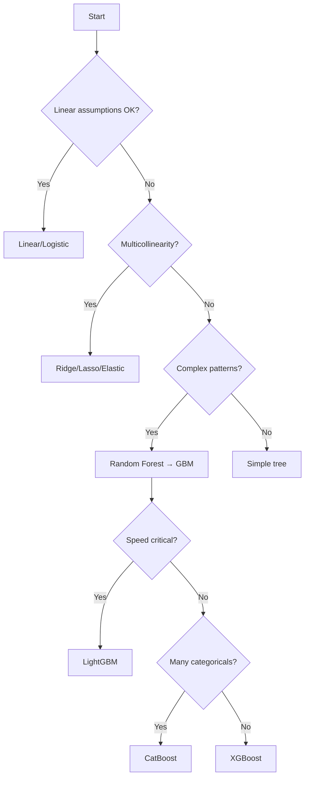

# DS-AutoAdvisor — **Seasoned DS Edition**  
**Production-Ready, Scalable, and Easy-to-Glance Workflow**

> **Streamlined pipeline with a seasoned data scientist's perspective**  
> Every step includes: **what to do**, **why it matters**, and **how to scale it safely in production**

---

## 🎯 Operating Principles
| Principle | What It Means | Implementation |
|-----------|---------------|----------------|
| **Reproducibility** | Same input → same output | Pin versions, set seeds, version everything (MLflow/DVC) |
| **Idempotency** | Safe to re-run | Atomic writes, outputs with hash/timestamp |
| **Observability** | Track everything | Log inputs/metrics/artifacts, trace lineage |
| **Data Contracts** | Explicit schemas | Validate with Great Expectations/pydantic |
| **Security/Privacy** | PII protection | Mask/hash/salt, access control, audit logs |
| **Cost/Latency** | Budget awareness | Set targets early (p95 <50ms, cost/1k preds) |

---

## 📊 Phase 1: Data Profiling

### Quick Wins Checklist
- [ ] **Dataset Overview**: shape, dtypes, missing %, memory  
- [ ] **Target Analysis**: class balance, obvious leakage  
- [ ] **Cardinality Check**: high-cardinality categoricals  
- [ ] **Distribution Sanity**: skew, outliers via plots  

### Association Tests - When to Use What

| Variable Types | Small Data (n<5k) | Large Data (n>5k) | Interpretation |
|----------------|-------------------|-------------------|----------------|
| **Numeric ↔ Numeric** | Pearson (linear), Spearman (monotonic) | Visual correlation heatmap | Kendall for ties/small n |
| **Numeric ↔ Categorical** | ANOVA | Kruskal-Wallis | Group differences |
| **Categorical ↔ Categorical** | Cramér's V, Theil's U | Chi-square test | Association strength |

### 🎯 **ML Context Quick Decisions**
- **Trees** → forgive noise, focus on target balance & leakage
- **Linear/SVM/NN** → need clean distributions & scaling
- **Time-constrained** → check target balance, cardinality, obvious leakage only

### 🚀 **Production Scaling**
- **Large datasets** → stratified sample 1-5% for EDA
- **Storage** → columnar format (Parquet/Delta), partition by date
- **Validation** → Great Expectations on raw + post-ingest data

---

## 🧹 Phase 2: Data Cleaning & Preprocessing

### 2.1 Outlier Detection - Method Comparison

| Method | Best For | Pros | Cons | When to Use |
|--------|----------|------|------|-------------|
| **IQR** | Univariate, robust | Simple, interpretable | Misses multivariate | Small p, quick baseline |
| **Z-Score** | Normal distributions | Fast, familiar | Assumes normality | Gaussian-like data |
| **Isolation Forest** | High-dimensional | Handles complex patterns | Black box | p>10, complex data |
| **LOF** | Clustered data | Finds local outliers | Computationally heavy | Density-based patterns |
| **Elliptic Envelope** | Gaussian data | Multivariate | Strong assumptions | Well-justified Gaussian |
| **Ensemble Vote** | Production use | Robust consensus | More complex | **Recommended for prod** |

### 🎯 **Decision Tree**
```
Data size < 10k? → IQR/Z-Score
High-dimensional? → Isolation Forest  
Clustered patterns? → LOF
Production system? → Majority vote (IQR + Isolation Forest)
```

---

### 2.2 Missing Data - Strategy Matrix

| Missing % | Strategy | Methods | Notes |
|-----------|----------|---------|-------|
| **< 5%** | Simple imputation | Mean/Median/Mode | Fast, minimal bias |
| **5-20%** | Advanced imputation | KNN/Iterative (MICE) | If features are correlated |
| **20-40%** | Feature engineering | Create "missing" flags | Often informative |
| **> 40%** | ⚠️ **Redesign needed** | Drop or collect more data | Too much missing |

### 🎯 **ML Model Considerations**
- **LightGBM/XGBoost** → handles NaNs natively, keep it simple
- **Linear/SVM/NN** → must impute, fit on train only
- **Streaming systems** → prefer constant/median for speed

---

### 2.3 Scaling & Transformation - Quick Reference

| Method | Use Case | Distribution | Model Types |
|--------|----------|--------------|-------------|
| **StandardScaler** | Default choice | Gaussian-like | Linear/SVM/NN |
| **MinMaxScaler** | Need [0,1] range | Any | Neural networks |
| **RobustScaler** | Many outliers | Skewed | Linear models with outliers |
| **Yeo-Johnson** | Heavy skew (±) | Any values | Normalizing transform |
| **Box-Cox** | Heavy skew (+) | Positive only | Normalizing transform |
| **log/log1p** | Right skew | Positive/with zeros | Simple, interpretable |

### 🚨 **Key Rules**
- **Trees** → skip scaling entirely
- **Linear/SVM/NN** → always scale
- **Heavy skew** → transform first, then scale

---

### 2.4 Categorical Encoding - Cardinality Decision Matrix

| Cardinality | Primary Choice | Alternative | Notes |
|-------------|----------------|-------------|-------|
| **< 10** | One-Hot | Ordinal (if ordered) | Standard approach |
| **10-50** | Binary Encoding | Target Encoding | Balance efficiency/info |
| **50-500** | Target Encoding (CV) | Frequency Encoding | High signal potential |
| **> 500** | Frequency + Hashing | Target (careful CV) | Avoid explosion |

### 🎯 **Model-Specific Guidelines**

| Model Family | Recommended | Avoid | Special Notes |
|--------------|-------------|-------|---------------|
| **Trees** | Label, Binary, Target | One-Hot (high-card) | CatBoost handles native |
| **Linear/Logistic** | One-Hot, Binary, Target | Label Encoding | Check VIF < 5 |
| **SVM/NN** | One-Hot, Binary | Label Encoding | Standardize after encoding |

### 🚨 **VIF Thresholds**
- **< 5** → Good to go
- **5-10** → Monitor closely  
- **> 10** → Re-encode or drop features

---

## 📈 Phase 3: Statistical Testing - When It Matters

### Testing Decision Matrix

| Using Model Type | Required Tests | Skip If | Action If Violated |
|------------------|----------------|---------|-------------------|
| **Linear/Logistic** | VIF, Homoscedasticity, Linearity | Using trees | Transform or switch models |
| **Trees/Ensembles** | Class imbalance only | All assumption tests | Use class weights |
| **Time series** | Add Durbin-Watson | Static data | Add lags/differences |
| **Large n (>10k)** | Visual diagnostics | Formal normality tests | Plots over p-values |

### 🎯 **Quick Thresholds**
| Test | Good | Monitor | Action Needed |
|------|------|---------|---------------|
| **VIF** | < 5 | 5-10 | > 10 |
| **Correlation** | < 0.7 | 0.7-0.9 | > 0.9 |
| **Class Balance** | 60/40 | 70/30-90/10 | > 90/10 |
| **Durbin-Watson** | 1.5-2.5 | 1.0-1.5, 2.5-3.0 | < 1.0, > 3.0 |

---

## 🤖 Phase 4: Model Selection & Training

### 4.1 Model Selection Flowchart



### 🎯 **Production Model Preferences**
1. **LightGBM** → Best speed/scale balance
2. **CatBoost** → Categorical-heavy datasets
3. **XGBoost** → Maximum performance, slower
4. **Linear** → Interpretability required

---

### 4.2 Hyperparameter Optimization Strategy

| Budget | Method | Trials | When to Use |
|--------|--------|--------|-------------|
| **Low** | Default params | 1 | Quick baseline |
| **Medium** | Random Search | 50-100 | Most common case |
| **High** | Optuna (TPE) | 200+ | ROI justifies cost |
| **Very High** | Optuna + Pruning | 500+ | Competition/critical |

### 🚀 **Scaling HPO**
- **Parallelize** with Ray/Dask/Spark
- **Early stopping** to save compute
- **Set budgets** (time/CPU/trials)
- **Use repeated CV** to reduce noise

---

## 📏 Phase 5: Evaluation & Validation

### 5.1 Metric Selection Matrix

| Problem Type | Balanced Data | Imbalanced Data | Business Focus |
|--------------|---------------|-----------------|----------------|
| **Binary Classification** | Accuracy, ROC-AUC | **PR-AUC, F1** | Cost-sensitive threshold |
| **Multi-class** | Accuracy, Macro F1 | Weighted F1 | Per-class precision/recall |
| **Regression** | R², RMSE | MAE (robust) | Business metric alignment |
| **Ranking** | MAP@K | NDCG | User engagement |

### 🎯 **Imbalance Thresholds**
- **Majority > 90%** → Use PR-AUC, class weights, SMOTE
- **Majority 70-90%** → Monitor both ROC-AUC and PR-AUC  
- **Majority < 70%** → Standard metrics OK

---

### 5.2 Cross-Validation Strategy

| Data Type | CV Method | Folds | Special Considerations |
|-----------|-----------|-------|----------------------|
| **IID Data** | Stratified K-Fold | 5 | Maintain class ratios |
| **Time Series** | TimeSeriesSplit | 5 | Respect temporal order |
| **Small Data** | Leave-One-Out | n | High variance |
| **Large Data** | Simple K-Fold | 3 | Computational efficiency |

---

## 🔍 Phase 6: Interpretability

### Method Comparison

| Method | Scope | Compute Cost | Best For |
|--------|-------|--------------|----------|
| **Feature Importance** | Global | Low | Quick overview |
| **Permutation Importance** | Global | Medium | Model-agnostic ranking |
| **SHAP TreeExplainer** | Global + Local | Low | Tree models |
| **SHAP KernelExplainer** | Global + Local | **High** | Any model (sample data) |
| **Partial Dependence** | Global | Medium | Feature effects |
| **Individual Conditional** | Local | Medium | Instance-level patterns |

### 🎯 **Production Recommendations**
- **Trees** → Use TreeSHAP (fast)
- **Linear** → Coefficients + permutation
- **Complex models** → SHAP on samples only
- **Real-time** → Pre-compute global importance

---

## 🚨 Quick Reference Thresholds

| Metric | Good | Monitor | Action Required |
|--------|------|---------|-----------------|
| **VIF** | < 5 | 5-10 | > 10 |
| **Feature Count** | < 100 | 100-300 | > 500 |
| **Missing %** | < 5% | 5-20% | > 40% |
| **Class Imbalance** | < 70% | 70-90% | > 90% |
| **Outlier % (IQR)** | < 1% | 1-5% | > 10% |
| **p95 Latency** | < 50ms | 50-200ms | > 200ms |

---

## ⚡ 90-Second Daily Flow

1. **Profile** → Target balance, dtypes, missing %, cardinality (on sample)
2. **Encode** → Use cardinality thresholds above
3. **Scale** → Only for linear/SVM/NN  
4. **Clean** → Cap outliers for linear; skip for GBMs
5. **Model** → Baseline → CV → Quick Random Search
6. **Report** → Business metric + PR-AUC (if imbalanced) + top SHAP drivers
7. **Deploy** → Register model + encoders, add drift monitors

---

## 🛠️ Production Tooling Checklist

### Core Stack
- [ ] **Data**: Parquet/Delta, partitioning, schema registry
- [ ] **Pipeline**: Airflow/Prefect, idempotent tasks  
- [ ] **Tracking**: MLflow (params, metrics, artifacts)
- [ ] **Registry**: Model + preprocessor bundles
- [ ] **Serving**: FastAPI/Triton with autoscaling
- [ ] **Monitoring**: Prometheus/Grafana + drift detection
- [ ] **Security**: Secrets manager, RBAC, PII policies

### Monitoring Setup
- [ ] **Data Drift**: KS/PSI tests with thresholds
- [ ] **Performance**: Track vs baseline, trigger retrain
- [ ] **Operations**: p95 latency, throughput, error rates  
- [ ] **Business**: Cost per 1k predictions, revenue impact

---

*This guide balances speed with thoroughness - use the quick flows for iteration, scale up the full process for production systems.*