# 📊 DS-AutoAdvisor v3.0 - Comprehensive Statistical Methods Analysis

## Overview

This document provides a comprehensive analysis of all statistical approaches, methods, assumptions, and limitations in your DS-AutoAdvisor v3.0 pipeline. Understanding these will help you make informed decisions about data suitability and interpret results correctly.

---

## 🏗️ **PIPELINE ARCHITECTURE & STATISTICAL FLOW**

### **Statistical Decision Tree**
```
Raw Data → Profiling → Quality Assessment → Cleaning → Advisory → Training → Evaluation
    ↓           ↓              ↓             ↓         ↓         ↓         ↓
Statistical  Data Quality   Assumption    Statistical Model    Model     Performance
Profiling    Scoring        Testing       Selection    Training  Validation
```

---

## 📊 **STAGE 1: DATA PROFILING & QUALITY ASSESSMENT**

### **1.1 Data Profiling Methods**

#### **YData Profiling (pandas-profiling)**
- **Method:** Comprehensive univariate and bivariate statistical analysis
- **Statistics Used:**
  - Descriptive statistics (mean, median, mode, std, skewness, kurtosis)
  - Distribution analysis with Kolmogorov-Smirnov tests
  - Correlation analysis (Pearson, Spearman, Kendall)
  - Missing data patterns analysis

**Prerequisites:**
- ✅ Numerical data for statistical measures
- ✅ At least 3 data points per column
- ✅ Memory sufficient for data size (scales with O(n²) for correlations)

**Assumptions:**
- ✅ Data is representative of population
- ✅ Missing data is MAR (Missing At Random) or MCAR (Missing Completely At Random)
- ⚠️ Large datasets may require sampling

**Limitations:**
- ❌ **Memory Intensive:** O(n²) correlation matrix for large feature sets
- ❌ **Processing Time:** Exponentially increases with data size
- ❌ **Categorical Handling:** Limited for high-cardinality categories

**Target Input Groups:**
- ✅ **Optimal:** 100-100K rows, 5-100 features
- ⚠️ **Acceptable:** Up to 1M rows with sampling
- ❌ **Avoid:** >10GB datasets without chunking

### **1.2 Enhanced Data Quality System**

#### **Data Type Inference**
- **Method:** Multi-stage heuristic classification with confidence scoring
- **Algorithms:**
  - Pattern matching for datetime formats
  - Statistical tests for numerical vs categorical
  - Cardinality-based classification rules

**Mathematical Basis:**
```python
# Confidence Score Calculation
confidence = (matching_patterns / total_patterns) * dtype_consistency_score

# Numerical Detection
is_numeric = can_convert_to_float AND (unique_count / total_count) > threshold
```

**Prerequisites:**
- ✅ Consistent data formatting within columns
- ✅ Representative sample size (>30 values recommended)

**Assumptions:**
- ✅ Data types are consistent within columns
- ✅ Missing values don't dominate the column (>50% non-null)
- ⚠️ Mixed types indicate data quality issues

---

## 🧹 **STAGE 2: DATA CLEANING & PREPROCESSING**

### **2.1 Comprehensive Outlier Detection Methods**

DS-AutoAdvisor v3.0 provides a complete suite of outlier detection methods, from simple statistical approaches to advanced machine learning techniques, including ensemble methods for robust detection.

#### **Statistical Methods**

**1. Interquartile Range (IQR) Method**
```python
# Mathematical Foundation
Q1, Q3 = df[col].quantile([0.25, 0.75])
IQR = Q3 - Q1
outlier_condition = (x < Q1 - factor * IQR) | (x > Q3 + factor * IQR)
```

**Properties:**
- **Assumptions:** None (distribution-free)
- **Robust to:** Non-normal distributions, skewed data
- **Parameters:** IQR factor (default: 1.5)
- **Best for:** Univariate outlier detection, easy interpretation
- **Limitations:** Only considers marginal distributions

**2. Z-Score Method**
```python
# Mathematical Foundation
z_score = |x - μ| / σ
outlier_condition = |z_score| > threshold
```

**Properties:**
- **Assumptions:** Normal distribution (optimal)
- **Parameters:** Z-score threshold (default: 3.0)
- **Best for:** Normally distributed data, quick screening
- **Limitations:** Sensitive to distribution shape, not robust to outliers in calculation

#### **Machine Learning Methods**

**3. Isolation Forest**
```python
# Mathematical Foundation
Anomaly_Score = 2^(-E(h(x))/c(n))
where:
- E(h(x)) = average path length of x in isolation trees
- c(n) = average path length of BST with n points
```

**Properties:**
- **Assumptions:** Outliers are sparse and different from normal points
- **Parameters:** contamination rate (default: 0.01), n_estimators
- **Best for:** High-dimensional data, mixed data types
- **Strengths:** Linear time complexity, handles mixed types
- **Limitations:** Parameter sensitivity, requires sufficient sample size

**4. Local Outlier Factor (LOF)**
```python
# Mathematical Foundation
LOF(x) = Σ(lrd(y)/lrd(x)) / |N_k(x)|
where:
- lrd = local reachability density
- N_k(x) = k-nearest neighbors of x
```

**Properties:**
- **Assumptions:** Local density variations indicate anomalies
- **Parameters:** n_neighbors (default: 20), contamination (default: 0.01)
- **Best for:** Data with clusters of varying density
- **Strengths:** Detects local anomalies, handles clusters well
- **Limitations:** Sensitive to parameter choice, computational complexity O(n²)

**5. Elliptic Envelope (Covariance-based)**
```python
# Mathematical Foundation
# Assumes data follows multivariate Gaussian distribution
# Uses robust covariance estimation (Minimum Covariance Determinant)
mahalanobis_distance = sqrt((x - μ)ᵀ Σ⁻¹ (x - μ))
```

**Properties:**
- **Assumptions:** Multivariate Gaussian distribution
- **Parameters:** contamination (default: 0.01), support_fraction (auto)
- **Best for:** Multivariate normal data, global outliers
- **Strengths:** Theoretically sound for Gaussian data
- **Limitations:** Strong distributional assumptions, not robust to non-Gaussian data

#### **Ensemble Outlier Detection**

**6. Ensemble Methods**
```python
# Available Ensemble Strategies
ensemble_methods = ['iqr', 'isoforest', 'zscore', 'lof', 'elliptic_envelope']
voting_strategies = ['union', 'intersection', 'majority']
```

**Voting Strategies:**
- **Union:** Point is outlier if ANY method flags it (most sensitive)
- **Intersection:** Point is outlier if ALL methods flag it (most conservative)
- **Majority:** Point is outlier if majority of methods flag it (balanced)

**Properties:**
- **Assumptions:** Different methods capture different types of outliers
- **Parameters:** ensemble_methods list, voting strategy, individual method parameters
- **Best for:** Robust outlier detection, production environments
- **Strengths:** Reduces false positives/negatives, method diversity
- **Limitations:** Computational overhead, parameter tuning complexity

#### **Method Selection Guidelines**

| Method | Sample Size | Dimensions | Distribution | Use Case |
|--------|-------------|------------|--------------|----------|
| **IQR** | n ≥ 10 | Univariate | Any | Quick screening, interpretability |
| **Z-Score** | n ≥ 30 | Univariate | Normal | Fast, simple datasets |
| **Isolation Forest** | n ≥ 100 | High-dim | Any | Production, mixed types |
| **LOF** | n ≥ 50 | Medium | Any | Clustered data, local anomalies |
| **Elliptic Envelope** | n ≥ features×2 | Multivariate | Gaussian | Theoretical soundness |
| **Ensemble** | n ≥ 100 | Any | Any | Robust production systems |

**Recommended Configurations:**

1. **Exploratory Analysis:**
   ```yaml
   outlier_method: "iqr"
   iqr_factor: 1.5
   ```

2. **Production Pipeline:**
   ```yaml
   outlier_method: "ensemble"
   ensemble_methods: ['iqr', 'isoforest', 'lof']
   ensemble_voting: "majority"
   ensemble_contamination: 0.05
   ```

3. **High-Quality Gaussian Data:**
   ```yaml
   outlier_method: "ensemble"
   ensemble_methods: ['zscore', 'elliptic_envelope']
   ensemble_voting: "intersection"
   ```

### **2.2 Missing Data Handling**

#### **Imputation Methods Available:**

**1. Simple Imputation**
```python
# Mean/Median/Mode imputation
imputed_value = df[col].mean()  # or median(), mode()
```

**2. K-Nearest Neighbors Imputation**
```python
# Distance-based imputation
imputed_value = weighted_average(k_nearest_neighbors)
# Uses Euclidean distance for numerical, Hamming for categorical
```

**3. Iterative Imputation (MICE-like)**
```python
# Multiple Imputation by Chained Equations
for feature in features_with_missing:
    model = fit_regression(other_features, feature)
    impute(feature, model.predict(other_features))
```

**Statistical Assumptions:**

| Method | Missing Mechanism | Assumption | Best For |
|--------|------------------|------------|----------|
| **Mean/Median** | MCAR | Missing Completely At Random | Simple, fast |
| **KNN** | MAR | Missing At Random | Mixed data types |
| **Iterative** | MAR | Missing At Random | Complex dependencies |

**Prerequisites:**
- ✅ **KNN:** At least 5 complete cases per missing case
- ✅ **Iterative:** At least 100 samples, <30% missing per feature
- ✅ **All methods:** Missing rate <70% overall

### **2.3 Feature Scaling & Transformation**

#### **Scaling Methods:**

**1. StandardScaler (Z-score normalization)**
```python
x_scaled = (x - μ) / σ
```
- **Assumption:** Normal distribution (optimal)
- **Robust to:** Linear transformations
- **Sensitive to:** Outliers

**2. MinMaxScaler**
```python
x_scaled = (x - min) / (max - min)
```
- **Assumption:** Known min/max bounds
- **Range:** [0, 1]
- **Sensitive to:** Outliers at extremes

**3. RobustScaler**
```python
x_scaled = (x - median) / IQR
```
- **Assumption:** None (robust)
- **Robust to:** Outliers
- **Best for:** Non-normal distributions

**4. MaxAbsScaler**
```python
x_scaled = x / max(|x|)
```
- **Range:** [-1, 1]
- **Preserves:** Sparsity
- **Best for:** Sparse data

**5. QuantileTransformer**
```python
# Uniform: maps to uniform distribution [0, 1]
# Normal: maps to standard normal distribution
```
- **Purpose:** Distribution transformation
- **Robust to:** Outliers
- **Best for:** Non-linear transformations

#### **Mathematical Transformations:**

**1. Power Transformations**
```python
# Yeo-Johnson (handles negative values)
y(λ) = ((x+1)^λ - 1) / λ  if λ ≠ 0, x ≥ 0

# Box-Cox (positive values only)
y(λ) = (x^λ - 1) / λ     if λ ≠ 0, x > 0
```

**2. Logarithmic Transformations**
```python
# Natural log
y = ln(x)        # Requires x > 0

# Log1p (handles zeros)
y = ln(1 + x)    # Requires x ≥ 0
```

**3. Root Transformations**
```python
# Square root
y = √x           # Requires x ≥ 0

# Reciprocal
y = 1/x          # Requires x ≠ 0
```

#### **Transformation Method Comparison**

| Transformation   | Purpose                                      | Robust to         | Best for                      |
|------------------|----------------------------------------------|-------------------|-------------------------------|
| **log**          | Reduce right skew, stabilize variance        | Not robust to 0s  | Positive, highly skewed data  |
| **log1p**        | Like log, but handles zeros                  | Not robust to 0s  | Data with zeros, mild skew    |
| **sqrt**         | Reduce moderate skew, compress range         | Not robust to negatives | Count data, moderate skew |
| **square**       | Amplify differences, increase spread         | Not robust to outliers | Emphasizing large values   |
| **reciprocal**   | Invert scale, reduce impact of large values  | Not robust to zeros | Rates, ratios, positive data |
| **boxcox**       | Normalize distribution, stabilize variance   | Not robust to negatives/zeros | Positive, non-normal data |
| **yeojohnson**   | Normalize, stabilize variance (negatives ok) | Robust to negatives | Non-normal, mixed sign data  |
| **polynomial**   | Model non-linear relationships               | Not robust to outliers | Feature engineering         |

**Notes:**
- For log/log1p/boxcox, input must be positive (log1p allows zero).
- Yeo-Johnson works for both positive and negative values.
- Sqrt and reciprocal require non-negative/non-zero input.
- Polynomial transformation can increase model complexity and risk of overfitting.

### **2.4 Comprehensive Encoding Strategies**

#### **Categorical Encoding Methods:**

**1. One-Hot Encoding**
```python
# Creates binary columns for each category
# Example: Color=[Red, Blue, Green] → Color_Red, Color_Blue, Color_Green
```
- **Mathematical:** Binary vector representation
- **Assumption:** No ordinal relationship
- **Best for:** Low cardinality (<20 categories)
- **Limitation:** Curse of dimensionality

**2. Label Encoding**
```python
# Maps categories to integers: {cat1: 0, cat2: 1, cat3: 2}
```
- **Mathematical:** Integer mapping
- **Assumption:** Ordinal relationship exists OR tree-based models
- **Risk:** Introduces artificial ordering
- **Best for:** Tree-based models, ordinal data

**3. Ordinal Encoding**
```python
# User-defined order: {low: 0, medium: 1, high: 2}
```
- **Mathematical:** User-defined integer mapping
- **Assumption:** True ordinal relationship
- **Requirement:** Domain knowledge
- **Best for:** Naturally ordered categories

**4. Binary Encoding**
```python
# Converts to binary representation
# Example: 8 categories → 3 binary columns (2^3 = 8)
```
- **Mathematical:** Binary number system
- **Advantage:** Reduces dimensionality vs one-hot
- **Best for:** High cardinality (50-1000 categories)

**5. Frequency Encoding**
```python
# Replaces category with its frequency count
frequency_map = df[col].value_counts().to_dict()
```
- **Mathematical:** Count-based mapping
- **Captures:** Category prevalence
- **Risk:** Information loss for rare categories

**6. Target/Mean Encoding**
```python
# Replaces category with mean target value for that category
target_means = df.groupby(category)[target].mean()
```
- **Mathematical:** Conditional expectation E[y|category]
- **Advantage:** High predictive power
- **Risk:** Target leakage, overfitting
- **Requirement:** Target variable available

**Cardinality Guidelines:**

| Cardinality | Recommended Encoding | Alternative |
|-------------|---------------------|-------------|
| 2-5 categories | One-Hot | Label |
| 5-20 categories | One-Hot | Ordinal (if ordered) |
| 20-50 categories | Binary or Target | Frequency |
| 50+ categories | Target or Hash | Embedding |

---

## 🤖 **STAGE 3: STATISTICAL ASSUMPTION TESTING & ADVISORY**

### **3.1 Assumption Testing Framework**

#### **Normality Testing**

**Methods Available:**
1. **Shapiro-Wilk Test** (default for n ≤ 5000)
2. **Anderson-Darling Test**
3. **Jarque-Bera Test**
4. **D'Agostino's Test**

**Mathematical Basis:**
```python
# Shapiro-Wilk Test Statistic
W = (Σ a_i * x_(i))² / Σ(x_i - x̄)²

# Anderson-Darling Test Statistic  
A² = -n - (1/n) * Σ(2i-1)[ln(F(x_i)) + ln(1-F(x_(n+1-i)))]
```

**Test Selection:**

| Test | Sample Size | Power | Best For |
|------|-------------|-------|----------|
| **Shapiro-Wilk** | 3 ≤ n ≤ 5000 | High | Small to medium samples |
| **Anderson-Darling** | n > 5000 | High | Large samples |
| **Jarque-Bera** | n > 30 | Medium | Quick screening |

#### **Homoscedasticity Testing**

**1. Breusch-Pagan Test** (default)
```python
# Test statistic follows χ² distribution
LM = n * R² (from auxiliary regression)
```

**2. White Test**
```python
# More general, tests for any heteroscedasticity
# Includes cross-terms and squared terms
```

#### **Multicollinearity Detection**

**1. Variance Inflation Factor (VIF)**
```python
VIF_j = 1 / (1 - R²_j)
where R²_j = R² from regressing x_j on all other x_k
```

**2. Correlation Matrix Analysis**
```python
# High correlation threshold
|correlation| > 0.95 (configurable)
```

**VIF Interpretation:**
- ✅ **No concern:** VIF < 5
- ⚠️ **Moderate:** 5 ≤ VIF < 10
- ❌ **High concern:** VIF ≥ 10

#### **Linearity Testing**

**Harvey-Collier Test**
```python
# Tests for linearity in mean function
# t-statistic tests if E[y|x] is linear
```

#### **Independence Testing**

**Durbin-Watson Test**
```python
DW = Σ(e_t - e_{t-1})² / Σe_t²
where e_t are residuals
```

**Interpretation:**
- ✅ **No autocorrelation:** 1.5 < DW < 2.5
- ⚠️ **Positive autocorrelation:** DW < 1.5
- ⚠️ **Negative autocorrelation:** DW > 2.5

#### **Class Balance Analysis**

**Class Imbalance Detection**
```python
# Major class proportion calculation
major_class_prop = max(class_counts) / total_samples
imbalance_ratio = major_class_prop / minor_class_prop

# Threshold-based detection
imbalance_detected = major_class_prop > threshold (default: 0.9)
```

**Properties:**
- **Purpose:** Identify class distribution problems in classification
- **Metrics:** Class proportions, imbalance ratios, minimum class sizes
- **Thresholds:** Configurable imbalance detection (default: 90% majority class)

### **3.2 Enhanced Statistical Testing Implementation**

The pipeline implements sophisticated statistical testing with performance optimizations and robust error handling.

#### **Scalable Testing Framework**

**Performance Optimizations:**

| Feature | Purpose | Configuration | Impact |
|---------|---------|---------------|---------|
| **Sampling** | Handle large datasets | `normality_max_sample: 5000` | O(log n) vs O(n) |
| **Chunking** | Memory management | `chunk_size: 10000` | Constant memory |
| **Feature Limiting** | VIF calculation control | `max_features_vif: 50` | Prevent O(p³) explosion |
| **Early Stopping** | Skip invalid tests | Minimum sample checks | Fail-fast validation |

#### **Advanced Normality Testing**

**Test Selection Algorithm:**
```python
# Automatic test method selection
if sample_size <= 5000:
    method = "shapiro"        # Highest power for small samples
elif sample_size > 5000:
    method = "anderson"       # Better for large samples
elif quick_screening:
    method = "jarque_bera"    # Fast asymptotic test
else:
    method = "normaltest"     # D'Agostino omnibus test
```

**Enhanced Metrics:**
- **Skewness:** `γ₁ = E[(X-μ)³]/σ³` - measures asymmetry
- **Kurtosis:** `γ₂ = E[(X-μ)⁴]/σ⁴ - 3` - measures tail heaviness
- **Sample Size:** Actual observations used after dropna()
- **Test Power:** Method-specific statistical power

#### **Robust Multicollinearity Detection**

**Two-Stage Approach:**
```python
# Stage 1: Fast correlation screening
correlation_matrix = X.corr().abs()
high_corr_pairs = correlation_matrix > threshold

# Stage 2: VIF calculation (if feasible)
if n_features <= max_features_vif:
    VIF_j = 1 / (1 - R²_j)  # For each feature j
```

**Scalability Features:**
- **Correlation First:** O(p²) vs O(p³) for VIF
- **Feature Limiting:** Skip VIF for high-dimensional data
- **Sampling:** Use representative samples for VIF calculation
- **Error Handling:** Graceful degradation for numerical issues

#### **Comprehensive Homoscedasticity Testing**

**Test Methods Available:**

| Method | Statistical Basis | Null Hypothesis | Alternative |
|--------|------------------|-----------------|-------------|
| **Breusch-Pagan** | LM = n·R² ~ χ²(p) | Homoscedastic errors | Heteroscedastic |
| **White Test** | More general form | Constant variance | Variance depends on X |

**Mathematical Implementation:**
```python
# Breusch-Pagan Test
# 1. Fit OLS model: y = Xβ + ε
# 2. Get residuals: e = y - Xβ̂  
# 3. Auxiliary regression: e² = Zγ + u
# 4. Test statistic: LM = n·R²_aux ~ χ²(p)

# White Test  
# 1. Include all X, X², X₁X₂ terms in auxiliary regression
# 2. More robust to functional form
```

#### **Advanced Linearity Assessment**

**Harvey-Collier Test Implementation:**
```python
# Mathematical foundation:
# H₀: E[y|x] is linear in x
# H₁: E[y|x] is not linear in x

# Test procedure:
# 1. Order observations by fitted values
# 2. Calculate recursive residuals
# 3. Test if mean of recursive residuals = 0
# 4. t-statistic follows t-distribution
```

**Properties:**
- **Purpose:** Detect non-linear relationships in mean function
- **Power:** High against polynomial alternatives
- **Assumptions:** Requires adequate sample size (n > p + 10)

### **3.3 Model Recommendation Logic**

### **3.3 Model Recommendation Logic**

The pipeline implements intelligent model recommendation based on comprehensive assumption testing and target variable analysis.

#### **Target Type Inference**

**Automatic Classification:**
```python
def infer_target_type(df, target, class_threshold=20):
    n_unique = df[target].nunique()
    dtype = df[target].dtype
    
    # Rule-based classification
    if dtype in ["object", "category", "bool"]:
        return "classification"
    if np.issubdtype(dtype, np.integer) and n_unique <= class_threshold:
        return "classification" 
    return "regression"
```

**Classification Criteria:**

| Condition | Target Type | Reasoning |
|-----------|-------------|-----------|
| `dtype` in ["object", "category", "bool"] | Classification | Categorical data types |
| Integer dtype + `n_unique ≤ 20` | Classification | Discrete classes |
| Continuous numeric | Regression | Continuous target variable |

#### **Assumption-Based Model Selection**

**Regression Models:**

| Assumptions Status | Violations | Recommended Models | Rationale |
|-------------------|------------|-------------------|-----------|
| **All Passed** | None | LinearRegression, Ridge, Lasso | OLS assumptions satisfied |
| **Multicollinearity** | High VIF/correlation | Ridge, Lasso | Regularization handles correlation |
| **Non-linearity** | Linearity violated | RandomForest, GradientBoosting, HistGradientBoosting | Tree models capture non-linear patterns |
| **Multiple Violations** | Complex patterns | XGBoostRegressor, LightGBMRegressor, SVR | Robust ensemble methods |

**Classification Models:**

| Data Characteristics | Class Balance | Recommended Models | Rationale |
|---------------------|---------------|-------------------|-----------|
| **Assumptions OK** | Balanced | LogisticRegression, LinearSVC | Linear separability |
| **Class Imbalance** | Imbalanced | XGBoostClassifier, BalancedRandomForest, CatBoost | Built-in imbalance handling |
| **Complex Patterns** | Balanced | RandomForestClassifier, GradientBoosting, ExtraTrees | Non-parametric robustness |

#### **Advanced Recommendation Features**

**Risk Assessment Matrix:**

```python
# Risk scoring for model recommendations
risk_factors = {
    "normality_violation": {"risk": "medium", "models": ["Ridge", "Lasso"]},
    "multicollinearity": {"risk": "high", "models": ["Ridge", "Lasso", "ElasticNet"]},
    "heteroscedasticity": {"risk": "medium", "models": ["RobustRegression", "GLM"]},
    "non_linearity": {"risk": "high", "models": ["TreeBased", "KernelMethods"]},
    "autocorrelation": {"risk": "high", "models": ["TimeSeriesModels", "ARIMA"]},
    "class_imbalance": {"risk": "critical", "models": ["BalancedEnsembles", "SMOTE"]}
}
```

**Mathematical Foundations by Model Class:**

**Linear Models:**
```python
# OLS: minimize ||y - Xβ||²
# Ridge: minimize ||y - Xβ||² + α||β||²
# Lasso: minimize ||y - Xβ||² + α||β||₁
# ElasticNet: minimize ||y - Xβ||² + α₁||β||₁ + α₂||β||²
```

**Tree-Based Models:**
```python
# Random Forest: Bootstrap aggregating of decision trees
# Gradient Boosting: Sequentially fit trees to residuals
# XGBoost: Optimized gradient boosting with regularization
```

**Properties:**
- **Robustness:** Tree models handle non-linearity, interactions, missing values
- **Interpretability:** Linear models provide coefficient interpretation
- **Scalability:** Different models for different data sizes and complexity

#### **Business Logic Integration**

**Model Selection Criteria:**

1. **Statistical Validity:** Ensure assumptions are met or model is robust to violations
2. **Business Requirements:** Consider interpretability vs accuracy trade-offs  
3. **Data Characteristics:** Match model complexity to data size and patterns
4. **Computational Constraints:** Consider training time and inference speed
5. **Maintenance Requirements:** Factor in model monitoring and updates

**Recommendation Confidence Scoring:**
```python
confidence_score = (
    assumption_tests_passed_ratio * 0.4 +
    data_quality_score * 0.3 +
    sample_size_adequacy * 0.2 +
    feature_quality_score * 0.1
)
```

### **3.4 Statistical Recommendation Generation**

The pipeline provides actionable recommendations based on failed assumptions and detected data patterns.

#### **Transformation Recommendations**

**Normality Violations:**
- **Log Transformation:** For right-skewed data (`log(x + 1)`)
- **Square Root:** For count data (`√x`)
- **Box-Cox:** For general power transformations (`(x^λ - 1)/λ`)
- **Yeo-Johnson:** For negative values handling

**Non-linearity Solutions:**
- **Polynomial Features:** Add x², x³ terms for curved relationships
- **Interaction Terms:** Capture feature interactions (x₁ × x₂)
- **Spline Features:** Piecewise polynomial fitting
- **Non-linear Models:** Switch to tree-based or kernel methods

#### **Feature Engineering Recommendations**

**Multicollinearity Handling:**
- **Feature Selection:** Remove high-VIF features systematically
- **Principal Component Analysis:** Orthogonal transformation
- **Regularization:** L1/L2 penalties for automatic selection
- **Domain Knowledge:** Combine correlated features meaningfully

**Class Imbalance Solutions:**
- **SMOTE:** Synthetic minority oversampling
- **Random Undersampling:** Reduce majority class
- **Stratified Sampling:** Maintain proportions in train/test
- **Cost-Sensitive Learning:** Weighted loss functions

#### **Model-Specific Recommendations**

**For Linear Models:**
```python
recommendations = {
    "preprocessing": ["StandardScaler", "PowerTransformer"],
    "validation": ["cross_validation", "residual_analysis"],
    "diagnostics": ["leverage_plots", "influence_measures"]
}
```

**For Tree-Based Models:**
```python
recommendations = {
    "hyperparameters": ["max_depth", "min_samples_split", "n_estimators"],
    "validation": ["out_of_bag", "feature_importance"],
    "diagnostics": ["tree_visualization", "partial_dependence"]
}
```

**Properties:**
- **Actionable:** Specific steps to address identified issues
- **Prioritized:** Critical issues addressed first
- **Traceable:** Clear reasoning for each recommendation
- **Measurable:** Success criteria for each suggested action

---

## 🏋️ **STAGE 4: MODEL TRAINING & STATISTICAL LEARNING**

### **4.1 Model Categories & Statistical Foundations**

#### **Linear Models**

**1. Linear/Logistic Regression**
- **Mathematical Basis:** OLS, Maximum Likelihood
- **Assumptions:** Linear relationship, independence, homoscedasticity, normality
- **Best for:** Interpretable models, small datasets

**2. Ridge Regression (L2)**
```python
Cost = MSE + α * Σβ²
```
- **Handles:** Multicollinearity
- **Trade-off:** Bias-variance via α

**3. Lasso Regression (L1)**
```python
Cost = MSE + α * Σ|β|
```
- **Handles:** Feature selection + multicollinearity
- **Property:** Sparse solutions

#### **Tree-Based Models**

**1. Random Forest**
- **Basis:** Bootstrap aggregating + random features
- **Assumptions:** Minimal (non-parametric)
- **Strengths:** Non-linearity, interactions, mixed types

**2. Gradient Boosting**
- **Basis:** Gradient descent in function space
- **Strengths:** High performance, missing data handling
- **Risk:** Overfitting, parameter sensitivity

### **4.2 Hyperparameter Optimization**

#### **HPO Performance Analysis: Methods Comparison**

**Available Methods:**
1. **Grid Search** - Exhaustive parameter grid search
2. **Random Search** - Random sampling from parameter distributions  
3. **Optuna TPE + Pruning** - Bayesian optimization with early stopping

**Performance Characteristics:**

| Method | Best For | Limitations | Recommended Trials |
|--------|----------|-------------|-------------------|
| **Grid Search** | Small discrete spaces (≤3 params) | Exponential growth | Full grid |
| **Random Search** | High-dimensional continuous | May miss optimal regions | ≥50 trials |
| **TPE + Pruning** | Large continuous spaces | Needs sufficient trials | ≥100 trials |

**Common Pitfalls & Solutions:**

❌ **TPE Underperformance Issues:**
- **Too few trials:** TPE needs ≥50-100 trials to build good surrogate model
- **Aggressive pruning:** Can discard promising candidates early
- **Noisy objectives:** High CV variance misleads optimizer
- **Small parameter spaces:** Random/grid search may be better

✅ **Optimization Strategies:**
```yaml
# Conservative TPE configuration
optuna_hpo_settings:
  sampler: "TPE"
  pruner: "MedianPruner"
  n_startup_trials: 20    # More conservative startup
  n_warmup_steps: 15      # More warmup steps
  timeout_minutes: 60     # Longer search time

# Robust random search baseline
random_search_settings:
  sampler: "Random"
  pruner: "None"
  n_trials: 100
```

---

## 📈 **STAGE 5: MODEL EVALUATION & STATISTICAL VALIDATION**

### **5.1 Performance Metrics**

#### **Classification Metrics:**

**1. Accuracy**
```python
Accuracy = (TP + TN) / (TP + TN + FP + FN)
```

**2. F1-Score**
```python
F1 = 2 * (Precision * Recall) / (Precision + Recall)
```

**3. ROC-AUC**
```python
AUC = ∫ TPR d(FPR)
```

#### **Regression Metrics:**

**1. R-squared**
```python
R² = 1 - (SS_res / SS_tot)
```

**2. Mean Absolute Error**
```python
MAE = Σ|y_true - y_pred| / n
```

**3. Root Mean Square Error**
```python
RMSE = √(Σ(y_true - y_pred)² / n)
```

### **5.2 Statistical Validation Methods**

#### **Cross-Validation Strategy**
- **Stratified K-Fold** (Classification) - Maintains class distribution
- **K-Fold** (Regression) - Simple random splitting
- **Default:** 5-fold CV

#### **Model Diagnostics**
- **Learning Curves** - Bias vs variance analysis
- **Validation Curves** - Hyperparameter sensitivity
- **Residual Analysis** - Model assumption validation
- **SHAP Analysis** - Feature importance with interactions

---

## 🎯 **PIPELINE LIMITATIONS & TARGET INPUT GROUPS**

### **🔴 Critical Limitations**

#### **Sample Size Requirements**

| Component | Minimum | Recommended | Maximum Efficient |
|-----------|---------|-------------|------------------|
| **Statistical Tests** | n ≥ 30 | n ≥ 100 | n ≤ 10,000 |
| **Outlier Detection** | n ≥ 50 | n ≥ 200 | No limit |
| **Model Training** | n ≥ 50 | n ≥ 1,000 | No limit |
| **Cross Validation** | n ≥ 100 | n ≥ 500 | n ≤ 1,000,000 |

#### **Feature Space Limitations**

| Component | Max Features | Limitation | Workaround |
|-----------|--------------|------------|------------|
| **VIF Calculation** | 50 | O(p³) complexity | Pre-selection |
| **Correlation Matrix** | 100 | Memory O(p²) | Chunking |
| **One-Hot Encoding** | 20 categories | Dimensionality | Alternative encoding |
| **LOF Computation** | 1000 samples | O(n²) complexity | Sampling |

### **🎯 Optimal Target Input Groups**

#### **Ideal Dataset Characteristics**

✅ **Dataset Size:**
- **Rows:** 500 - 100,000
- **Features:** 5 - 50
- **Missing data:** < 30% per column
- **Memory footprint:** < 1GB

✅ **Data Quality:**
- **Consistent data types** within columns
- **Reasonable outlier percentage** (< 5%)
- **Sufficient class representation** (≥ 30 samples per class)
- **Low to moderate multicollinearity** (VIF < 10)

#### **Method-Specific Recommendations**

**Outlier Detection:**
```yaml
# Small datasets (n < 500)
outlier_method: "iqr"

# Medium datasets (500 ≤ n < 5000)  
outlier_method: "ensemble"
ensemble_methods: ['iqr', 'isoforest']
ensemble_voting: "majority"

# Large datasets (n ≥ 5000)
outlier_method: "ensemble" 
ensemble_methods: ['iqr', 'isoforest', 'lof']
ensemble_voting: "union"
ensemble_contamination: 0.05
```

**Encoding Strategy:**
```yaml
# Low cardinality (< 10 categories)
encoding: "onehot"

# Medium cardinality (10-50 categories)
encoding: "binary"

# High cardinality (> 50 categories)
encoding: "target"  # or "frequency"
```

---

## 📋 **COMPREHENSIVE CONFIGURATION GUIDE**

### **Complete YAML Configuration Example**

```yaml
# Enhanced Data Cleaning Configuration
data_cleaning:
  # Outlier Detection
  outlier_detection:
    outlier_removal: true
    outlier_method: "ensemble"          # iqr, isoforest, zscore, lof, elliptic_envelope, ensemble
    
    # Individual method parameters
    iqr_factor: 1.5                     # IQR multiplier (1.0-3.0)
    iforest_contam: 0.01                # Isolation Forest contamination (0.001-0.1)
    zscore_thresh: 3.0                  # Z-score threshold (2.0-5.0)
    lof_n_neighbors: 20                 # LOF neighbors (5-50)
    lof_contamination: 0.01             # LOF contamination (0.001-0.1)
    elliptic_contamination: 0.01        # Elliptic contamination (0.001-0.1)
    elliptic_support_fraction: null     # Elliptic support (null=auto, 0.1-1.0)
    
    # Ensemble parameters
    ensemble_methods: ['iqr', 'isoforest', 'lof']  # Methods to combine
    ensemble_voting: "majority"         # union, intersection, majority
    ensemble_contamination: 0.05        # Overall contamination rate
  
  # Missing Data Handling
  missing_data:
    impute_num: "knn"                   # mean, median, knn, iterative
    impute_cat: "most_frequent"         # most_frequent, constant
    knn_neighbors: 5                    # KNN imputation neighbors
  
  # Feature Scaling
  scaling:
    method: "standard"                  # standard, minmax, robust, maxabs, quantile_uniform, quantile_normal
    
  # Categorical Encoding  
  encoding:
    method: "auto"                      # auto, onehot, label, ordinal, binary, frequency, target
    max_cardinality_onehot: 20          # Threshold for one-hot encoding
    target_encoding_smoothing: 1.0      # Smoothing for target encoding
  
  # Transformations
  transformations:
    skew_correction: true               # Apply skew correction
    skew_threshold: 1.0                 # Skewness threshold
    skew_method: "yeo-johnson"          # yeo-johnson, box-cox, log, log1p
```

### **Method Selection Decision Tree**

```python
def select_outlier_method(data_size, n_features, distribution_type, computational_budget):
    """Intelligent outlier detection method selection"""
    
    if data_size < 100:
        return "iqr"  # Only robust method for small data
    
    elif data_size < 1000:
        if n_features <= 5:
            return "zscore" if distribution_type == "normal" else "iqr"
        else:
            return "isoforest"  # Handles high dimensions well
    
    elif data_size < 10000:
        if computational_budget == "low":
            return "iqr"
        elif distribution_type == "gaussian":
            return {"method": "ensemble", "methods": ["zscore", "elliptic_envelope"]}
        else:
            return {"method": "ensemble", "methods": ["iqr", "isoforest", "lof"]}
    
    else:  # Large datasets
        if computational_budget == "high":
            return {"method": "ensemble", "methods": ["iqr", "isoforest", "lof"], "voting": "majority"}
        else:
            return "isoforest"  # Scales well, single method
```

This comprehensive analysis ensures that users understand every statistical method available in DS-AutoAdvisor v3.0, can make informed decisions about method selection, and properly configure the pipeline for their specific use cases.

1. **Isolation Forest:**
   ```
   Anomaly Score = 2^(-E(h(x))/c(n))
   where E(h(x)) = average path length of x in isolation trees
   c(n) = average path length of BST with n points
   ```

2. **Local Outlier Factor:**
   ```
   LOF(x) = Σ(lrd(y)/lrd(x)) / |N_k(x)|
   where lrd = local reachability density
   ```

3. **Z-Score:**
   ```
   Z = |x - μ| / σ
   Outlier if |Z| > threshold (typically 3)
   ```

4. **IQR Method:**
   ```
   Outlier if x < Q1 - 1.5*IQR or x > Q3 + 1.5*IQR
   where IQR = Q3 - Q1
   ```

**Prerequisites & Assumptions:**

| Method | Prerequisites | Assumptions | Best For |
|--------|---------------|-------------|----------|
| **Isolation Forest** | n ≥ 100 samples | Outliers are sparse and different | High-dimensional data |
| **LOF** | n ≥ 50 samples | Local density varies | Clusters with varying density |
| **Z-Score** | n ≥ 30 samples | Normal distribution | Normally distributed data |
| **IQR** | n ≥ 10 samples | No distribution assumption | Robust, any distribution |
| **Elliptic Envelope** | n ≥ features×2 | Gaussian distribution | Multivariate normal data |

**Limitations:**
- ❌ **Curse of Dimensionality:** Performance degrades with >20 features
- ❌ **Sample Size Dependency:** Unreliable with small datasets
- ❌ **Parameter Sensitivity:** Results vary with contamination parameters

---

## 🧹 **STAGE 2: DATA CLEANING & PREPROCESSING**

### **2.1 Missing Data Handling**

#### **Imputation Methods Available:**

1. **Simple Imputation**
   - Mean/Median/Mode (univariate)
   - Constant value imputation

2. **K-Nearest Neighbors Imputation**
   ```python
   # Distance metric: Euclidean for numerical, Hamming for categorical
   imputed_value = weighted_average(k_nearest_neighbors)
   ```

3. **Iterative Imputation (MICE-like)**
   ```python
   # Multiple Imputation by Chained Equations
   for feature in features_with_missing:
       model = fit_regression(other_features, feature)
       impute(feature, model.predict(other_features))
   ```

**Statistical Assumptions:**

| Method | Assumption | Missing Mechanism | Best For |
|--------|------------|-------------------|----------|
| **Mean/Median** | MCAR | Missing Completely At Random | Simple, fast imputation |
| **KNN** | MAR | Missing At Random | Mixed data types |
| **Iterative** | MAR | Missing At Random | Complex dependencies |

**Prerequisites:**
- ✅ **KNN:** At least 5 complete cases per missing case
- ✅ **Iterative:** At least 100 samples, <30% missing per feature
- ✅ **All methods:** Missing rate <70% overall

**Limitations:**
- ❌ **Bias Introduction:** All methods can introduce bias
- ❌ **Uncertainty Underestimation:** Single imputation underestimates variance
- ❌ **MNAR Handling:** No method handles Missing Not At Random well

### **2.2 Feature Scaling & Transformation**

#### **Scaling Methods:**

1. **StandardScaler (Z-score normalization)**
   ```python
   x_scaled = (x - μ) / σ
   ```
   - **Assumption:** Normal distribution (optimal)
   - **Robust to:** Linear transformations
   - **Sensitive to:** Outliers

2. **MinMaxScaler**
   ```python
   x_scaled = (x - min) / (max - min)
   ```
   - **Assumption:** Known min/max bounds
   - **Robust to:** Bounded distributions
   - **Sensitive to:** Outliers at extremes

3. **RobustScaler**
   ```python
   x_scaled = (x - median) / IQR
   ```
   - **Assumption:** None (robust)
   - **Robust to:** Outliers
   - **Best for:** Non-normal distributions

#### **Transformation Methods:**

1. **Power Transformations (Yeo-Johnson)**
   ```python
   # Yeo-Johnson transformation for normality
   y(λ) = ((x+1)^λ - 1) / λ  if λ ≠ 0, x ≥ 0
   ```
   - **Purpose:** Achieve normality
   - **Assumption:** Continuous data
   - **Limitation:** May not always achieve normality

**Prerequisites:**
- ✅ **Continuous numerical data** for transformations
- ✅ **Sufficient variance** (σ > 0)
- ✅ **No infinite values**

### **2.3 Encoding Strategies**

#### **Categorical Encoding Methods:**

1. **One-Hot Encoding**
   - **Mathematical:** Binary vector representation
   - **Assumption:** No ordinal relationship
   - **Limitation:** Curse of dimensionality with high cardinality

2. **Label Encoding**
   - **Mathematical:** Integer mapping
   - **Assumption:** Ordinal relationship or tree-based models
   - **Risk:** Introduces artificial ordering

3. **Ordinal Encoding**
   - **Mathematical:** User-defined ordering
   - **Assumption:** True ordinal relationship exists
   - **Requirement:** Domain knowledge for ordering

**Cardinality Thresholds:**
- ✅ **One-Hot:** <20 categories (configurable)
- ⚠️ **High Cardinality:** >50 categories need special handling
- ❌ **Avoid One-Hot:** >100 categories

### **2.4 Feature Engineering Methods**

Feature engineering methods such as binning, interaction features, polynomial features, date extraction, encoding, and text vectorization are used to enhance model performance and interpretability. The following table summarizes the main feature engineering techniques available in the pipeline:

| Method                | Purpose                                                                 | Robust to                | Best for                                      |
|-----------------------|------------------------------------------------------------------------|--------------------------|------------------------------------------------|
| **Binning (equal_width, equal_frequency, quantile, kmeans)** | Discretize continuous variables, reduce noise, handle non-linearity | Outliers (quantile, kmeans), non-normality     | Tree models, interpretability, handling skewed data |
| **Interaction Features**  | Capture relationships between variables, model non-additive effects     | Feature scaling, encoding | Complex patterns, boosting model accuracy      |
| **Polynomial Features**   | Model non-linear relationships, increase feature space                  | Outliers (with scaling)   | Linear models, capturing curvature            |
| **Date Extraction**       | Extract temporal features (year, month, day, etc.)                     | Missing values, format    | Time series, seasonality, trend analysis       |
| **Encoding (onehot, label, ordinal, target, mean)** | Convert categorical to numeric, handle high cardinality              | Unseen categories (target/mean), scaling       | Categorical variables, boosting, tree models        |
| **Text Vectorization (tfidf, count, hash)** | Convert text to numeric, capture semantic meaning                     | Noise, rare words         | NLP tasks, text classification                |
| **Feature Selection**     | Reduce dimensionality, remove redundant/irrelevant features            | Multicollinearity         | High-dimensional data, improving generalization|

#### **Detailed Feature Engineering Methods:**

**1. Binning Methods**
```python
# Equal Width Binning
df[f"{col_name}_binned"] = pd.cut(df[col_name], bins=n_bins, labels=False)

# Equal Frequency Binning  
df[f"{col_name}_binned"] = pd.qcut(df[col_name], q=n_bins, labels=False)

# Quantile-based Binning
quantiles = np.linspace(0, 1, n_bins + 1)
df[f"{col_name}_binned"] = pd.cut(df[col_name], bins=df[col_name].quantile(quantiles).values)

# KMeans-based Binning
kmeans = KMeans(n_clusters=n_bins)
df[f"{col_name}_binned"] = kmeans.fit_predict(df[col_name].values.reshape(-1, 1))
```

**Properties:**
- **Purpose:** Convert continuous variables to categorical, reduce noise, handle non-linear relationships
- **Configuration:** `binning: "equal_width"/"equal_frequency"/"quantile"/"kmeans"`, `n_bins: 5` (default)
- **Best for:** Tree-based models, interpretability, handling skewed distributions

**2. Feature Interactions**
```python
# Multiplicative Interactions
df[f"{col1}_{col2}_interaction"] = df[col1] * df[col2]

# Additive Interactions  
df[f"{col1}_{col2}_sum"] = df[col1] + df[col2]

# Ratio Interactions
df[f"{col1}_{col2}_ratio"] = df[col1] / (df[col2] + 1e-8)  # Avoid division by zero
```

**Properties:**
- **Purpose:** Capture non-additive relationships between features
- **Configuration:** `feature_interactions: ["col1", "col2", "col3"]`
- **Best for:** Complex patterns, boosting algorithms, non-linear relationships

**3. Date Feature Extraction**
```python
# Temporal Features
df[f"{col_name}_year"] = df[col_name].dt.year
df[f"{col_name}_month"] = df[col_name].dt.month
df[f"{col_name}_dayofweek"] = df[col_name].dt.dayofweek
df[f"{col_name}_quarter"] = df[col_name].dt.quarter
df[f"{col_name}_is_weekend"] = (df[col_name].dt.dayofweek >= 5).astype(int)
```

**Properties:**
- **Purpose:** Extract meaningful temporal patterns from datetime columns
- **Configuration:** `extract_date_features: ["year", "month", "day", "dayofweek", "quarter", "is_weekend", "hour", "minute"]`
- **Best for:** Time series analysis, seasonality detection, trend modeling

Each method can be configured in the pipeline YAML or via column-specific settings. See the configuration guide for details on how to enable or customize these techniques.

### **2.5 Data Type Conversion & Validation**

The pipeline provides comprehensive data type conversion and validation capabilities to ensure data quality and consistency.

#### **Data Type Conversion Methods:**

| Target Type | Purpose | Configuration | Best for |
|-------------|---------|---------------|----------|
| **int** | Convert to integer with null handling | `dtype_conversion: "int"` | Numeric IDs, counts, ordinal data |
| **float** | Convert to floating point | `dtype_conversion: "float"` | Continuous numerical data |
| **str** | Convert to string | `dtype_conversion: "str"` | Text data, mixed-type columns |
| **bool** | Convert to boolean | `dtype_conversion: "bool"` | Binary flags, yes/no data |
| **category** | Convert to categorical | `dtype_conversion: "category"` | Memory optimization, ordered categories |
| **datetime** | Convert to datetime | `dtype_conversion: "datetime"` | Date/time data with format specification |

#### **Data Validation Constraints:**

```python
# Value Constraints Configuration
value_constraints:
  min_value: 0          # Minimum allowed value
  max_value: 100        # Maximum allowed value
  allowed_values: [1, 2, 3, 4, 5]  # Explicit allowed values
  regex_pattern: "^[A-Z]{2}[0-9]{4}$"  # Pattern matching
```

**Properties:**
- **Purpose:** Ensure data quality, enforce business rules, prevent invalid data
- **Robust to:** Format inconsistencies, invalid entries
- **Best for:** Critical business data, regulatory compliance

### **2.6 Text and String Cleaning**

Comprehensive text processing capabilities for cleaning and standardizing string data.

#### **Text Operations Available:**

| Operation | Purpose | Example | Configuration |
|-----------|---------|---------|---------------|
| **strip** | Remove leading/trailing whitespace | `" hello " → "hello"` | `text_operations: ["strip"]` |
| **lower** | Convert to lowercase | `"Hello" → "hello"` | `text_operations: ["lower"]` |
| **upper** | Convert to uppercase | `"hello" → "HELLO"` | `text_operations: ["upper"]` |
| **title** | Title case conversion | `"hello world" → "Hello World"` | `text_operations: ["title"]` |
| **remove_digits** | Remove all digits | `"abc123" → "abc"` | `text_operations: ["remove_digits"]` |
| **remove_punctuation** | Remove punctuation | `"hello!" → "hello"` | `text_operations: ["remove_punctuation"]` |
| **remove_extra_spaces** | Normalize whitespace | `"a  b" → "a b"` | `text_operations: ["remove_extra_spaces"]` |

#### **Advanced Text Processing:**

```python
# Regex-based replacements
regex_replace:
  "\\d{4}-\\d{2}-\\d{2}": "DATE_PLACEHOLDER"  # Replace dates
  "[A-Z]{2}\\d{4}": "CODE_PLACEHOLDER"        # Replace codes
```

**Properties:**
- **Purpose:** Standardize text data, remove noise, prepare for analysis
- **Configuration:** `text_cleaning: true`, `text_operations: [...]`, `regex_replace: {...}`
- **Best for:** Survey responses, free text fields, data standardization

### **2.7 Data Quality & Cleaning Steps**

#### **Deduplication**

```python
# Deduplication Configuration
remove_duplicates: true
duplicate_subset: ["col1", "col2"]  # Check specific columns only
```

**Properties:**
- **Purpose:** Remove exact duplicate rows, improve data quality
- **Configuration:** Global setting, optional column subset
- **Performance:** O(n log n) complexity

#### **Low Variance Removal**

```python
# Low variance removal
remove_low_variance: true
low_variance_thresh: 1  # Minimum unique values required
```

**Properties:**
- **Purpose:** Remove columns with little information content
- **Threshold:** Columns with ≤ threshold unique values are removed
- **Best for:** Feature selection, dimensionality reduction

#### **Column Dropping with Business Logic**

```python
# Column dropping configuration
drop_column: true
drop_reason: "unique_identifier"  # or "irrelevant", "redundant", "high_cardinality", "low_variance"
```

**Drop Reasons:**
- **unique_identifier:** Primary keys, IDs not useful for modeling
- **irrelevant:** Business-irrelevant columns
- **redundant:** Duplicate information available elsewhere
- **high_cardinality:** Too many unique values for encoding
- **low_variance:** Insufficient information content

### **2.8 Enhanced Outlier Treatment Methods**

Beyond basic outlier detection, the pipeline provides sophisticated outlier treatment options:

#### **Outlier Treatment Strategies:**

| Method | Purpose | When to Use | Configuration |
|--------|---------|-------------|---------------|
| **remove** | Remove outlier rows | Clean datasets, sufficient data | `outlier_treatment: "remove"` |
| **cap** | Cap to percentile bounds | Preserve data points | `outlier_treatment: "cap"` |
| **winsorize** | Winsorize to percentiles | Robust statistics | `outlier_treatment: "winsorize"` |
| **null** | Set outliers to null | For later imputation | `outlier_treatment: "null"` |
| **iqr_cap** | Cap using IQR bounds | Custom IQR factors | `outlier_treatment: "iqr_cap"` |
| **zscore_cap** | Cap using Z-score | Normal distributions | `outlier_treatment: "zscore_cap"` |
| **isolation_forest** | ML-based detection | Complex patterns | `outlier_treatment: "isolation_forest"` |

#### **Detailed Treatment Methods:**

```python
# Capping example
lower_bound = df[col].quantile(0.01)
upper_bound = df[col].quantile(0.99)
df[col] = df[col].clip(lower_bound, upper_bound)

# Winsorization example
from scipy.stats import mstats
df[col] = mstats.winsorize(df[col], limits=[0.01, 0.01])

# IQR capping with custom factor
Q1, Q3 = df[col].quantile([0.25, 0.75])
IQR = Q3 - Q1
lower_bound = Q1 - factor * IQR  # factor from outlier_threshold
upper_bound = Q3 + factor * IQR
df[col] = df[col].clip(lower_bound, upper_bound)
```

### **2.9 CSV Output Format Control**

The pipeline provides extensive control over output formatting for compatibility and compliance:

#### **Output Format Options:**

| Setting | Options | Purpose | Example |
|---------|---------|---------|---------|
| **output_delimiter** | `,`, `;`, `\t`, `\|` | Regional compatibility | European semicolon format |
| **output_quoting** | MINIMAL, ALL, NONNUMERIC, NONE | Data protection | Quote all fields for safety |
| **output_encoding** | utf-8, latin-1, cp1252 | Character compatibility | Unicode support |
| **output_lineterminator** | `\n`, `\r\n` | OS compatibility | Windows vs Unix |

#### **Predefined CSV Presets:**

```python
# Available presets
presets = {
    "quoted_semicolon": {delimiter: ";", quoting: QUOTE_ALL},
    "clean_semicolon": {delimiter: ";", quoting: QUOTE_MINIMAL},
    "standard_csv": {delimiter: ",", quoting: QUOTE_MINIMAL},
    "tab_separated": {delimiter: "\t", quoting: QUOTE_MINIMAL},
    "pipe_separated": {delimiter: "|", quoting: QUOTE_MINIMAL},
    "no_quotes": {delimiter: ";", quoting: QUOTE_NONE}
}
```

**Properties:**
- **Purpose:** Ensure output compatibility with downstream systems
- **Configuration:** Global settings with preset options
- **Best for:** Data exchange, regulatory compliance, system integration

---

## 🤖 **STAGE 3: STATISTICAL ASSUMPTION TESTING & ADVISORY**

### **3.1 Assumption Testing Framework**

#### **Normality Testing**

**Methods Available:**
1. **Shapiro-Wilk Test** (default for n ≤ 5000)
2. **Anderson-Darling Test**
3. **Jarque-Bera Test**
4. **D'Agostino's Test**

**Mathematical Basis:**
```python
# Shapiro-Wilk Test Statistic
W = (Σ a_i * x_(i))² / Σ(x_i - x̄)²

# Anderson-Darling Test Statistic  
A² = -n - (1/n) * Σ(2i-1)[ln(F(x_i)) + ln(1-F(x_(n+1-i)))]
```

**Assumptions & Limitations:**

| Test | Sample Size | Power | Best For |
|------|-------------|-------|----------|
| **Shapiro-Wilk** | 3 ≤ n ≤ 5000 | High | Small to medium samples |
| **Anderson-Darling** | n > 5000 | High | Large samples |
| **Jarque-Bera** | n > 30 | Medium | Quick screening |

**Configuration:**
- ✅ **Alpha level:** 0.05 (configurable)
- ✅ **Sample limit:** 5000 (automatic sampling for larger datasets)
- ⚠️ **Power consideration:** Tests become overly sensitive with very large n

#### **Homoscedasticity Testing**

1. **Breusch-Pagan Test** (default)
   ```python
   # Test statistic follows χ² distribution
   LM = n * R² (from auxiliary regression)
   ```

2. **White Test**
   ```python
   # More general, tests for any heteroscedasticity
   includes cross-terms and squared terms
   ```

**Prerequisites:**
- ✅ **Linear relationship** between features and target
- ✅ **Residuals available** (requires fitted model)
- ✅ **Sample size:** n > 20

#### **Multicollinearity Detection**

1. **Variance Inflation Factor (VIF)**
   ```python
   VIF_j = 1 / (1 - R²_j)
   where R²_j = R² from regressing x_j on all other x_k
   ```

2. **Correlation Matrix Analysis**
   ```python
   High correlation: |r| > 0.95 (configurable)
   ```

**Thresholds:**
- ✅ **No concern:** VIF < 5
- ⚠️ **Moderate:** 5 ≤ VIF < 10
- ❌ **High concern:** VIF ≥ 10

**Limitations:**
- ❌ **Computational Complexity:** O(p³) for p features
- ❌ **Feature Limit:** VIF calculation limited to 50 features
- ❌ **Missing Data:** Requires complete cases

#### **Linearity Testing**

1. **Harvey-Collier Test**
   ```python
   # Tests for linearity in mean function
   t-statistic tests if E[y|x] is linear
   ```

**Prerequisites:**
- ✅ **Regression relationship** exists
- ✅ **Continuous target** variable
- ✅ **No perfect multicollinearity**

#### **Independence Testing**

1. **Durbin-Watson Test**
   ```python
   DW = Σ(e_t - e_{t-1})² / Σe_t²
   where e_t are residuals
   ```

**Interpretation:**
- ✅ **No autocorrelation:** DW ≈ 2
- ⚠️ **Positive autocorrelation:** DW < 2
- ⚠️ **Negative autocorrelation:** DW > 2

### **3.2 Model Recommendation Logic**

#### **Decision Matrix:**

| Data Characteristics | Assumptions Violated | Recommended Models |
|---------------------|---------------------|-------------------|
| **Small Dataset (n<1000)** | None | Linear/Logistic Regression |
| **Large Dataset (n>10000)** | None | Ridge/Lasso Regression |
| **Non-linear relationships** | Linearity | Tree-based (RF, XGBoost) |
| **High multicollinearity** | Independence | Ridge/Lasso/Elastic Net |
| **Non-normal residuals** | Normality | Robust methods (Huber) |
| **Heteroscedasticity** | Homoscedasticity | Robust standard errors |
| **Class imbalance** | Balanced classes | Balanced ensembles |

**Target Type Inference:**
```python
# Classification vs Regression Logic
if dtype in ["object", "category", "bool"]:
    return "classification"
elif dtype is numeric and unique_count ≤ class_threshold:
    return "classification"  
else:
    return "regression"
```

---

## 🏋️ **STAGE 4: MODEL TRAINING & STATISTICAL LEARNING**

### **4.1 Model Categories & Statistical Foundations**

#### **Linear Models**

1. **Linear/Logistic Regression**
   - **Mathematical Basis:** Ordinary Least Squares, Maximum Likelihood
   - **Assumptions:**
     - ✅ Linear relationship
     - ✅ Independence of observations
     - ✅ Homoscedasticity
     - ✅ Normality of residuals (for inference)
   - **Best For:** Interpretable models, small datasets, linear relationships

2. **Ridge Regression (L2 Regularization)**
   ```python
   Cost = MSE + α * Σβ²
   ```
   - **Handles:** Multicollinearity
   - **Assumption:** Linear relationship
   - **Trade-off:** Bias-variance trade-off via α

3. **Lasso Regression (L1 Regularization)**
   ```python
   Cost = MSE + α * Σ|β|
   ```
   - **Handles:** Feature selection + multicollinearity
   - **Assumption:** Sparse solution exists
   - **Trade-off:** May arbitrarily select among correlated features

#### **Tree-Based Models**

1. **Random Forest**
   - **Mathematical Basis:** Bootstrap aggregating + random feature selection
   - **Assumptions:** Minimal (non-parametric)
   - **Strengths:** Handles non-linearity, feature interactions, mixed data types
   - **Limitations:** Can overfit with very noisy data

2. **Gradient Boosting (XGBoost/LightGBM)**
   - **Mathematical Basis:** Gradient descent in function space
   - **Assumptions:** Weak learners can be combined for strong prediction
   - **Strengths:** High predictive performance, handles missing data
   - **Risk:** Overfitting, hyperparameter sensitivity

#### **Distance-Based Models**

1. **K-Nearest Neighbors**
   - **Mathematical Basis:** Similarity-based prediction
   - **Assumptions:** Similar inputs → similar outputs
   - **Limitations:** Curse of dimensionality, sensitive to scale

2. **Support Vector Machines**
   - **Mathematical Basis:** Margin maximization
   - **Assumptions:** Data can be separated by hyperplane (with kernel)
   - **Strengths:** Effective in high dimensions
   - **Limitations:** Sensitive to scale, slow on large datasets

### **4.2 Cross-Validation Strategy**

#### **Methods Used:**

1. **Stratified K-Fold** (Classification)
   - Maintains class distribution across folds
   - **Default:** 5-fold CV

2. **K-Fold** (Regression)
   - Simple random splitting
   - **Default:** 5-fold CV

**Statistical Properties:**
- ✅ **Unbiased estimator** of generalization error
- ✅ **Variance reduction** through averaging
- ⚠️ **Computational cost** scales with k

...
### **4.3 Hyperparameter Optimization**

#### **Methods Available:**

1. **Grid Search**
   - **Approach:** Exhaustive search over parameter grid
   - **Best For:** Low-dimensional parameter spaces
   - **Limitation:** Exponential growth with parameters

2. **Random Search**
   - **Approach:** Random sampling from parameter distributions
   - **Advantage:** More efficient for high-dimensional spaces
   - **Default:** 50 iterations

3. **Optuna TPE + Pruning**
   - **Approach:** Bayesian optimization using Tree-structured Parzen Estimator (TPE) with early stopping (pruning)
   - **Advantage:** Efficient for complex, high-dimensional spaces; can skip poor candidates early
   - **Limitation:** May underperform compared to grid/random search in some cases (see analysis below)

**Search Spaces:**
```python
# Example parameter spaces
random_forest_params = {
    'n_estimators': [50, 100, 200, 500],
    'max_depth': [None, 10, 20, 30],
    'min_samples_split': [2, 5, 10],
    'min_samples_leaf': [1, 2, 4]
}
```

---

#### **HPO Performance Analysis: TPE vs Random/Grid Search**

**Key Observations:**
- TPE with pruning may sometimes yield lower performance than grid or random search, especially on small datasets or with aggressive pruning.
- Random/grid search can outperform TPE if:
  - The search space is small or discrete.
  - The number of trials is low (TPE needs enough trials to model the parameter space).
  - Pruning is too aggressive, causing promising candidates to be discarded early.
  - The objective function is noisy or non-smooth.

**Common Pitfalls:**
- **Too Few Trials:** TPE needs enough evaluations to build a good surrogate model. Use at least 50–100 trials for moderate spaces.
- **Aggressive Pruning:** Early stopping can discard candidates before their true potential is realized. Consider disabling or relaxing pruning for noisy objectives.
- **Parameter Space Complexity:** TPE excels in continuous, high-dimensional spaces. For small or categorical grids, random/grid search may be better.
- **Cross-Validation Noise:** High variance in CV scores can mislead the optimizer. Use more folds or repeated CV for stability.

**Recommendations:**
- For small or discrete parameter spaces, prefer grid or random search.
- For large, continuous spaces, use TPE with moderate pruning and sufficient trials.
- Always compare HPO methods on your data—sometimes simple random search is surprisingly effective.
- Tune pruning aggressiveness and trial count in your YAML config for best results.

**Example YAML Configurations:**
```yaml
optuna_hpo_settings:
  sampler: "TPE"
  pruner: "MedianPruner"
  direction: "maximize"
  n_startup_trials: 10
  n_warmup_steps: 10
  timeout_minutes: 30
  study_name_suffix: "custom"
```
Or for robust random search:
```yaml
optuna_hpo_settings:
  sampler: "Random"
  pruner: "None"
  direction: "maximize"
  n_startup_trials: 0
  n_warmup_steps: 0
  timeout_minutes: 30
  study_name_suffix: "random"
```

**Summary Table:**

| Method         | Best For                | Pitfalls                       | Recommendations                |
|----------------|------------------------|--------------------------------|--------------------------------|
| Grid Search    | Small/discrete spaces  | Exponential growth             | Use for ≤3 parameters          |
| Random Search  | High-dimensional       | May miss optimal regions       | Use ≥50 trials                 |
| TPE + Pruning  | Large/continuous       | Needs enough trials, pruning   | Use ≥100 trials, tune pruning  |

---

**Quick Fixes:**
- Increase number of trials for TPE.
- Relax or disable pruning if results are unstable.
- Use random search as a baseline for comparison.
- Always validate HPO results with cross-validation and holdout sets.

---


---

## 📈 **STAGE 5: MODEL EVALUATION & STATISTICAL VALIDATION**

### **5.1 Performance Metrics**

#### **Classification Metrics:**

1. **Accuracy**
   ```python
   Accuracy = (TP + TN) / (TP + TN + FP + FN)
   ```
   - **Assumption:** Balanced classes
   - **Limitation:** Misleading with imbalanced data

2. **F1-Score**
   ```python
   F1 = 2 * (Precision * Recall) / (Precision + Recall)
   ```
   - **Balances:** Precision and recall
   - **Best for:** Imbalanced datasets

3. **ROC-AUC**
   ```python
   AUC = ∫ TPR d(FPR)
   ```
   - **Measures:** Discriminative ability
   - **Assumption:** Well-calibrated probabilities

#### **Regression Metrics:**

1. **R-squared**
   ```python
   R² = 1 - (SS_res / SS_tot)
   ```
   - **Interpretation:** Proportion of variance explained
   - **Range:** (-∞, 1], higher is better

2. **Mean Absolute Error (MAE)**
   ```python
   MAE = Σ|y_true - y_pred| / n
   ```
   - **Robust to:** Outliers
   - **Units:** Same as target variable

3. **Root Mean Square Error (RMSE)**
   ```python
   RMSE = √(Σ(y_true - y_pred)² / n)
   ```
   - **Sensitive to:** Outliers
   - **Units:** Same as target variable

### **5.2 Statistical Validation Methods**

#### **Learning Curves**
- **Purpose:** Diagnose bias vs variance trade-off
- **Method:** Plot performance vs training set size
- **Interpretation:**
  - ✅ **Converging curves:** Well-tuned model
  - ⚠️ **Gap between train/val:** Overfitting
  - ⚠️ **Both curves plateau low:** Underfitting

#### **Validation Curves**
- **Purpose:** Hyperparameter sensitivity analysis
- **Method:** Plot performance vs single hyperparameter
- **Use:** Identify optimal parameter values

#### **Residual Analysis** (Regression)
```python
# Tests performed:
1. Residuals vs Fitted (heteroscedasticity)
2. Q-Q plot (normality)
3. Scale-Location plot (variance)
4. Residuals vs Leverage (influential points)
```

#### **SHAP Analysis**
- **Method:** Shapley Additive Explanations
- **Purpose:** Feature importance with interaction effects
- **Mathematical Basis:** Game theory, coalition contribution
- **Assumption:** Feature independence (for interpretation)

### **5.3 Model Stability Testing**

#### **Bootstrap Validation**
```python
# Procedure:
1. Bootstrap sample from original data
2. Train model on bootstrap sample  
3. Evaluate on out-of-bag samples
4. Repeat n_bootstrap times
5. Compute confidence intervals
```

#### **Noise Sensitivity Testing**
```python
# Test robustness by adding noise:
noise_levels = [0.01, 0.05, 0.1, 0.2]
for noise in noise_levels:
    X_noisy = X + noise * np.random.normal(size=X.shape)
    performance_change = evaluate(model, X_noisy, y)
```

---

## 🎯 **PIPELINE LIMITATIONS & TARGET INPUT GROUPS**

### **🔴 Critical Limitations**

#### **Sample Size Requirements**

| Analysis Component | Minimum Sample Size | Recommended Size | Maximum Efficient Size |
|-------------------|-------------------|------------------|----------------------|
| **Statistical Tests** | n ≥ 30 | n ≥ 100 | n ≤ 10,000 |
| **Model Training** | n ≥ 50 | n ≥ 1,000 | No limit (with chunking) |
| **Cross Validation** | n ≥ 100 | n ≥ 500 | n ≤ 1,000,000 |
| **SHAP Analysis** | n ≥ 50 | n ≥ 200 | n ≤ 1,000 (sampling) |

#### **Feature Space Limitations**

| Component | Features | Limitation | Workaround |
|-----------|----------|------------|------------|
| **VIF Calculation** | ≤ 50 | Computational complexity | Feature pre-selection |
| **Correlation Matrix** | ≤ 100 | Memory usage | Chunked computation |
| **One-Hot Encoding** | ≤ 20 categories | Curse of dimensionality | Use ordinal/target encoding |
| **SHAP Computation** | ≤ 50 | Exponential complexity | Feature importance filtering |

#### **Data Type Restrictions**

❌ **Not Supported:**
- Time series data (no temporal modeling)
- Image/audio data (no deep learning)
- Graph data (no network analysis)
- Text data (basic vectorization only)
- Streaming data (batch processing only)

✅ **Supported:**
- Tabular data (CSV format)
- Mixed data types (numerical + categorical)
- Missing data (with imputation)
- Imbalanced datasets (with appropriate metrics)

### **🎯 Optimal Target Input Groups**

#### **Ideal Dataset Characteristics**

✅ **Dataset Size:**
- **Rows:** 500 - 100,000
- **Features:** 5 - 50
- **Missing data:** < 30% per column
- **Memory footprint:** < 1GB

✅ **Data Quality:**
- **Consistent data types** within columns
- **Reasonable outlier percentage** (< 5%)
- **Sufficient class representation** (≥ 30 samples per class)
- **Low to moderate multicollinearity** (VIF < 10)

✅ **Problem Types:**
- **Binary classification** (most robust)
- **Multi-class classification** (≤ 20 classes)
- **Regression** (continuous targets)
- **Mixed data types** (numerical + categorical)

#### **Acceptable with Modifications**

⚠️ **Large Datasets (100K+ rows):**
- Enable chunking and sampling
- Use faster algorithms (LightGBM over XGBoost)
- Limit SHAP analysis to subset

⚠️ **High-Dimensional Data (50+ features):**
- Enable feature selection plugins
- Use regularized models
- Disable VIF calculation

⚠️ **Highly Imbalanced Data:**
- Use balanced ensembles
- Focus on F1/AUC metrics
- Consider resampling techniques

#### **Avoid These Scenarios**

❌ **Very Small Datasets (< 100 rows):**
- Statistical tests unreliable
- Cross-validation unstable
- Overfitting risk very high

❌ **Very High Cardinality (100+ categories):**
- One-hot encoding creates too many features
- Memory and computational issues
- Model interpretability suffers

❌ **Extreme Missing Data (> 70%):**
- Imputation becomes unreliable
- Models may not converge
- Results not trustworthy

---

## 📋 **RECOMMENDATIONS FOR OPTIMAL USAGE**

### **Pre-Processing Checklist**

1. **Data Validation:**
   - [ ] Check sample size requirements
   - [ ] Validate data types consistency
   - [ ] Assess missing data patterns
   - [ ] Identify outliers and their nature

2. **Statistical Prerequisites:**
   - [ ] Ensure sufficient samples per group/class
   - [ ] Check for perfect multicollinearity
   - [ ] Validate target variable distribution
   - [ ] Assess assumption test requirements

3. **Computational Considerations:**
   - [ ] Memory requirements within limits
   - [ ] Feature count manageable
   - [ ] Processing time expectations set
   - [ ] Sampling strategy if needed

### **When to Use Alternative Approaches**

- **Time Series:** Use specialized time series tools (ARIMA, Prophet)
- **Text Data:** Use NLP pipelines (spaCy, transformers)
- **Very Large Data:** Use distributed computing (Spark, Dask)
- **Deep Learning:** Use neural network frameworks (PyTorch, TensorFlow)
- **Causal Inference:** Use causal analysis tools (DoWhy, CausalML)

---

## 🗂️ **COMPREHENSIVE APPROACH SELECTION FRAMEWORK**

### **🔄 Pipeline Approach Selection Flowchart**

```mermaid
flowchart TD
    A[Raw Dataset] --> B{Data Size Check}
    
    B -->|n < 100| C[❌ STOP: Insufficient Data]
    B -->|100 ≤ n < 1000| D[Small Dataset Path]
    B -->|1000 ≤ n < 100K| E[Medium Dataset Path]
    B -->|n ≥ 100K| F[Large Dataset Path]
    
    D --> D1{Features < 20?}
    D1 -->|Yes| D2[Simple Models + Full Testing]
    D1 -->|No| D3[Feature Selection + Simple Models]
    
    E --> E1{Missing Data < 30%?}
    E1 -->|Yes| E2{Multicollinearity VIF < 10?}
    E1 -->|No| E3[Advanced Imputation Required]
    
    E2 -->|Yes| E4[Standard Pipeline]
    E2 -->|No| E5[Regularization Focus]
    
    F --> F1{Memory < 4GB?}
    F1 -->|Yes| F2[Chunking + Sampling Strategy]
    F1 -->|No| F3[Distributed/External Tools]
    
    E4 --> G{Target Type}
    E5 --> G
    D2 --> G
    D3 --> G
    E3 --> G
    F2 --> G
    
    G -->|Binary Class| H[Classification Pipeline]
    G -->|Multi-class| I{Classes ≤ 20?}
    G -->|Continuous| J[Regression Pipeline]
    
    I -->|Yes| H
    I -->|No| K[Hierarchical/Embedding Approach]
    
    H --> L{Class Balance}
    L -->|Balanced| M[Standard Metrics]
    L -->|Imbalanced| N[Balanced Sampling + F1/AUC]
    
    J --> O{Normality Tests}
    O -->|Normal| P[Linear Models Priority]
    O -->|Non-normal| Q[Tree-based Priority]
    
    M --> R[Model Selection]
    N --> R
    P --> R
    Q --> R
    K --> R
    
    R --> S{Business Requirements}
    S -->|Interpretability| T[Linear/Tree Models]
    S -->|Performance| U[Ensemble Methods]
    S -->|Speed| V[Simple Models]
    
    T --> W[Final Model Training]
    U --> W
    V --> W
    
    W --> X[Evaluation & Monitoring]
```



### **📊 Decision Matrix: Threshold-Based Approach Selection**

| **Metric** | **Threshold** | **Action** | **Alternative** |
|------------|---------------|------------|-----------------|
| **Sample Size (n)** | < 100 | ❌ Stop | Collect more data |
| | 100-1000 | Simple models only | Cross-validation with caution |
| | 1000-100K | Standard pipeline | Full methodology |
| | > 100K | Sampling + chunking | External distributed tools |
| **Feature Count (p)** | < 5 | Basic analysis | Consider feature engineering |
| | 5-20 | Standard processing | Full correlation analysis |
| | 20-50 | Feature selection advised | VIF monitoring required |
| | > 50 | ⚠️ Mandatory feature selection | Dimensionality reduction |
| **Missing Data %** | < 10% | Simple imputation | Mean/median/mode |
| | 10-30% | Advanced imputation | KNN/Iterative |
| | 30-50% | ⚠️ Careful imputation | Multiple imputation |
| | > 50% | ❌ Consider data collection | Domain expert consultation |
| **VIF Score** | < 5 | ✅ No action needed | Standard models |
| | 5-10 | ⚠️ Monitor closely | Consider regularization |
| | > 10 | ❌ Regularization required | Ridge/Lasso mandatory |
| **Class Imbalance** | Ratio < 2:1 | Standard metrics | Accuracy, precision, recall |
| | 2:1 - 10:1 | Balanced metrics | F1-score, balanced accuracy |
| | > 10:1 | ⚠️ Resampling required | SMOTE, undersampling |
| **Memory Usage** | < 1GB | Standard processing | In-memory operations |
| | 1-4GB | Chunking recommended | Batch processing |
| | > 4GB | ❌ External tools required | Dask, Spark |

### **🎯 Comprehensive Pre-Pipeline Checklist**

#### **Phase 1: Data Feasibility Assessment**
```
□ Sample Size Validation
  □ Minimum 100 samples total
  □ Minimum 30 samples per class (classification)
  □ Minimum 10 samples per feature (regression)
  
□ Data Quality Baseline
  □ No columns with >70% missing data
  □ Consistent data types within columns
  □ Target variable properly defined
  □ No data leakage (future information)
  
□ Computational Resource Check
  □ Dataset fits in available memory
  □ Processing time estimates acceptable
  □ Storage space sufficient for outputs
```

#### **Phase 2: Statistical Prerequisites**
```
□ Distribution Analysis
  □ Target variable distribution appropriate
  □ No extreme skewness (|skewness| < 3)
  □ Outlier percentage reasonable (< 10%)
  
□ Feature Space Validation
  □ No perfect multicollinearity (r = 1.0)
  □ Feature cardinality manageable
  □ No constant/near-constant features
  
□ Assumption Requirements Met
  □ Independence assumption reasonable
  □ Stationarity (if applicable)
  □ Linearity assumptions checked
```

#### **Phase 3: Business Alignment**
```
□ Objective Clarity
  □ Problem type clearly defined (classification/regression)
  □ Success metrics aligned with business goals
  □ Interpretability requirements specified
  □ Performance vs explainability trade-offs understood
  
□ Stakeholder Requirements
  □ Model deployment constraints identified
  □ Update frequency requirements specified
  □ Monitoring and maintenance plan defined
  □ Risk tolerance levels established
```

#### **Phase 4: Technical Configuration**
```
□ Pipeline Configuration
  □ Cross-validation strategy selected
  □ Evaluation metrics prioritized
  □ Hyperparameter search bounds set
  □ Feature selection methods chosen
  
□ Monitoring Setup
  □ Data drift detection configured
  □ Model drift thresholds set
  □ Business metric tracking enabled
  □ Alert systems configured
```

### **🔧 Enhanced Business Features & Plugin Architecture**

#### **1. Robust Feature Selection Plugin System**

```yaml
# Feature Selection Configuration
feature_selection:
  enabled: true
  methods:
    statistical:
      - chi_square_test      # p-value threshold: 0.05
      - mutual_information   # score threshold: 0.01
      - anova_f_test        # p-value threshold: 0.05
    ml_based:
      - recursive_elimination # step_size: 1, min_features: 5
      - feature_importance   # threshold: 0.001
      - lasso_selection     # alpha: auto-tune
  
  human_oversight:
    approval_required: true
    stages:
      - initial_selection    # Manual review of statistical results
      - ml_validation       # Review ML-based selections
      - final_confirmation  # Business logic validation
    
  business_rules:
    must_include: []        # Force-include critical features
    must_exclude: []        # Force-exclude features (PII, etc.)
    domain_knowledge: true  # Enable domain expert input
```

**Implementation Strategy:**
- **Stage 1:** Statistical filtering with p-value/score thresholds
- **Stage 2:** ML-based importance ranking with cross-validation
- **Stage 3:** Human review interface with business context
- **Stage 4:** Final selection with performance validation

#### **2. Continuous Monitoring & Drift Detection**

```yaml
# Monitoring Configuration
monitoring:
  data_drift:
    enabled: true
    methods:
      - kolmogorov_smirnov  # threshold: 0.05
      - population_stability_index  # threshold: 0.2
      - jensen_shannon_divergence   # threshold: 0.1
    
    schedule: "daily"
    alert_thresholds:
      warning: 0.1
      critical: 0.2
  
  model_drift:
    enabled: true
    metrics:
      - prediction_drift    # PSI threshold: 0.2
      - performance_degradation  # 5% drop threshold
      - confidence_distribution  # KS test p < 0.05
    
    schedule: "weekly"
    retraining_triggers:
      performance_drop: 0.05  # 5% relative drop
      drift_score: 0.2        # PSI threshold
      data_volume: 0.3        # 30% new data
  
  concept_drift:
    enabled: true
    detection_window: 30     # days
    significance_level: 0.01
    adaptation_strategy: "gradual"  # or "abrupt"
```

**Monitoring Hooks:**
```python
# Training Stage Hooks
@monitor_training_data
def data_quality_check(X_train, y_train):
    """Monitor training data quality and distribution"""
    pass

@monitor_model_performance  
def performance_tracking(model, X_val, y_val):
    """Track model performance during training"""
    pass

# Evaluation Stage Hooks
@monitor_prediction_drift
def prediction_distribution_check(y_pred, y_pred_historical):
    """Monitor prediction distribution changes"""
    pass

@trigger_retraining
def auto_retrain_decision(drift_scores, performance_metrics):
    """Automatically trigger retraining based on thresholds"""
    pass
```

#### **3. Business Metric Plugin System**

```yaml
# Business Metrics Configuration
business_metrics:
  enabled: true
  custom_kpis:
    revenue_impact:
      metric_type: "regression"
      calculation: "predicted_value * conversion_rate * avg_revenue"
      weight: 0.4
      
    customer_satisfaction:
      metric_type: "classification" 
      calculation: "precision_at_k"
      k_value: 100
      weight: 0.3
      
    operational_efficiency:
      metric_type: "cost_benefit"
      calculation: "true_positive_value - false_positive_cost"
      weight: 0.3
  
  alignment_tracking:
    ml_vs_business_correlation: true
    metric_importance_ranking: true
    roi_calculation: true
    
  reporting:
    dashboard_integration: true
    stakeholder_reports: "weekly"
    metric_decomposition: true
```

**Business Metric Integration:**
```python
class BusinessMetricTracker:
    def __init__(self, config):
        self.kpis = config['custom_kpis']
        self.weights = {kpi: cfg['weight'] for kpi, cfg in self.kpis.items()}
    
    def calculate_business_score(self, ml_predictions, business_context):
        """Calculate weighted business impact score"""
        business_score = 0
        for kpi_name, kpi_config in self.kpis.items():
            kpi_value = self._calculate_kpi(
                ml_predictions, 
                business_context, 
                kpi_config
            )
            business_score += kpi_value * self.weights[kpi_name]
        return business_score
    
    def optimize_for_business_objectives(self, model, threshold_range):
        """Find optimal decision threshold for business metrics"""
        best_threshold = None
        best_business_score = -float('inf')
        
        for threshold in threshold_range:
            predictions = (model.predict_proba()[:, 1] > threshold).astype(int)
            business_score = self.calculate_business_score(predictions, context)
            
            if business_score > best_business_score:
                best_business_score = business_score
                best_threshold = threshold
                
        return best_threshold, best_business_score
```

#### **4. Enhanced Pipeline Architecture**

```python
# Updated Pipeline Flow with Business Features
class EnhancedDSAutoAdvisor:
    def __init__(self):
        self.feature_selector = RobustFeatureSelector()
        self.drift_monitor = ContinuousMonitor()
        self.business_tracker = BusinessMetricTracker()
        
    def run_enhanced_pipeline(self, data, config):
        # Phase 1: Enhanced Data Profiling
        profile = self.data_profiler.profile_with_business_context(data, config)
        
        # Phase 2: Robust Feature Selection with Human Oversight
        selected_features = self.feature_selector.select_with_approval(
            data, 
            config['feature_selection'],
            human_review=True
        )
        
        # Phase 3: Model Training with Monitoring Hooks
        model = self.train_with_monitoring(
            data[selected_features], 
            config['monitoring']
        )
        
        # Phase 4: Business-Aligned Evaluation
        ml_metrics = self.evaluate_model(model, test_data)
        business_metrics = self.business_tracker.calculate_all_kpis(
            model.predictions, 
            business_context
        )
        
        # Phase 5: Continuous Monitoring Setup
        self.drift_monitor.setup_monitoring(
            model, 
            baseline_data,
            config['monitoring']
        )
        
        return {
            'model': model,
            'ml_metrics': ml_metrics,
            'business_metrics': business_metrics,
            'monitoring_config': config['monitoring'],
            'feature_importance': selected_features
        }
```

### **🎯 Integration Recommendations**

#### **Configuration File Updates**
Add to your `unified_config_v2.yaml`:
```yaml
# Enhanced Pipeline Configuration
enhanced_features:
  feature_selection:
    enabled: true
    human_oversight: true
    statistical_methods: ['chi_square', 'mutual_info']
    ml_methods: ['recursive_elimination', 'feature_importance']
    
  monitoring:
    data_drift: true
    model_drift: true
    concept_drift: true
    alert_system: "email"  # or "slack", "webhook"
    
  business_metrics:
    enabled: true
    custom_kpis: []  # Define your specific KPIs
    roi_tracking: true
    stakeholder_reports: true
```

#### **Plugin Directory Structure**
```
plugins/
├── feature_selection/
│   ├── statistical_selectors.py
│   ├── ml_selectors.py
│   └── human_interface.py
├── monitoring/
│   ├── drift_detectors.py
│   ├── performance_monitors.py
│   └── alert_systems.py
└── business_metrics/
    ├── kpi_calculators.py
    ├── roi_trackers.py
    └── report_generators.py
```

This enhanced framework ensures your DS-AutoAdvisor pipeline serves actual business objectives while maintaining statistical rigor and providing continuous monitoring capabilities.

---

