# 📊 DS-AutoAdvisor v2.0 - Statistical Methods Analysis

## Overview

This document provides a comprehensive analysis of all statistical approaches, methods, assumptions, and limitations in your DS-AutoAdvisor v2.0 pipeline. Understanding these will help you make informed decisions about data suitability and interpret results correctly.

---

## 🏗️ **PIPELINE ARCHITECTURE & STATISTICAL FLOW**

### **Statistical Decision Tree**
```
Raw Data → Profiling → Quality Assessment → Cleaning → Advisory → Training → Evaluation
    ↓           ↓              ↓             ↓         ↓         ↓         ↓
Statistical  Data Quality   Assumption    Statistical Model    Model     Performance
Profiling    Scoring        Testing       Selection    Training  Validation
```

---

## 📊 **STAGE 1: DATA PROFILING & QUALITY ASSESSMENT**

### **1.1 Data Profiling Methods**

#### **YData Profiling (pandas-profiling)**
- **Method:** Comprehensive univariate and bivariate statistical analysis
- **Statistics Used:**
  - Descriptive statistics (mean, median, mode, std, skewness, kurtosis)
  - Distribution analysis with Kolmogorov-Smirnov tests
  - Correlation analysis (Pearson, Spearman, Kendall)
  - Missing data patterns analysis

**Prerequisites:**
- ✅ Numerical data for statistical measures
- ✅ At least 3 data points per column
- ✅ Memory sufficient for data size (scales with O(n²) for correlations)

**Assumptions:**
- ✅ Data is representative of population
- ✅ Missing data is MAR (Missing At Random) or MCAR (Missing Completely At Random)
- ⚠️ Large datasets may require sampling

**Limitations:**
- ❌ **Memory Intensive:** O(n²) correlation matrix for large feature sets
- ❌ **Processing Time:** Exponentially increases with data size
- ❌ **Categorical Handling:** Limited for high-cardinality categories

**Target Input Groups:**
- ✅ **Optimal:** 100-100K rows, 5-100 features
- ⚠️ **Acceptable:** Up to 1M rows with sampling
- ❌ **Avoid:** >10GB datasets without chunking

### **1.2 Enhanced Data Quality System**

#### **Data Type Inference**
- **Method:** Multi-stage heuristic classification with confidence scoring
- **Algorithms:**
  - Pattern matching for datetime formats
  - Statistical tests for numerical vs categorical
  - Cardinality-based classification rules

**Mathematical Basis:**
```python
# Confidence Score Calculation
confidence = (matching_patterns / total_patterns) * dtype_consistency_score

# Numerical Detection
is_numeric = can_convert_to_float AND (unique_count / total_count) > threshold
```

**Prerequisites:**
- ✅ Consistent data formatting within columns
- ✅ Representative sample size (>30 values recommended)

**Assumptions:**
- ✅ Data types are consistent within columns
- ✅ Missing values don't dominate the column (>50% non-null)
- ⚠️ Mixed types indicate data quality issues

#### **Outlier Detection Ensemble**
- **Methods Available:**
  1. **Isolation Forest** (Unsupervised) 
  features: scales well, non-normality assumptions, mixed types possible (speed + robustness)
  2. **Local Outlier Factor** (Density-based) 
  features: detects local anomalies, non-normality assumptions, non-linear patterns (small to medium datasets)
  3. **Z-Score** (Statistical) 
  features: normality, univariate or mildly multivariate (simple & fast)
  4. **Interquartile Range (IQR)** (Robust statistical)
  features: handle skew, univariate checks, data not normal (easy to explain)
  5. **Elliptic Envelope** (Covariance-based)
  features: multivariate gaussian, normality assumption, Mahalanobis-distance-based detection, outliers are global not local (precise when assumptions met)

- **Recommendation**
 1. for exploratory data cleaning: z-score + iqr, ensemble_voting: false
 2. for robust production-level cleaning: IF + LOF + z-score, ensemble_voting: true, contamination_rate: 0.1
 3. for statistically controlled environments: z-score + elliptic envelope, ensemble_voting: true


**Mathematical Foundations:**

1. **Isolation Forest:**
   ```
   Anomaly Score = 2^(-E(h(x))/c(n))
   where E(h(x)) = average path length of x in isolation trees
   c(n) = average path length of BST with n points
   ```

2. **Local Outlier Factor:**
   ```
   LOF(x) = Σ(lrd(y)/lrd(x)) / |N_k(x)|
   where lrd = local reachability density
   ```

3. **Z-Score:**
   ```
   Z = |x - μ| / σ
   Outlier if |Z| > threshold (typically 3)
   ```

4. **IQR Method:**
   ```
   Outlier if x < Q1 - 1.5*IQR or x > Q3 + 1.5*IQR
   where IQR = Q3 - Q1
   ```

**Prerequisites & Assumptions:**

| Method | Prerequisites | Assumptions | Best For |
|--------|---------------|-------------|----------|
| **Isolation Forest** | n ≥ 100 samples | Outliers are sparse and different | High-dimensional data |
| **LOF** | n ≥ 50 samples | Local density varies | Clusters with varying density |
| **Z-Score** | n ≥ 30 samples | Normal distribution | Normally distributed data |
| **IQR** | n ≥ 10 samples | No distribution assumption | Robust, any distribution |
| **Elliptic Envelope** | n ≥ features×2 | Gaussian distribution | Multivariate normal data |

**Limitations:**
- ❌ **Curse of Dimensionality:** Performance degrades with >20 features
- ❌ **Sample Size Dependency:** Unreliable with small datasets
- ❌ **Parameter Sensitivity:** Results vary with contamination parameters

---

## 🧹 **STAGE 2: DATA CLEANING & PREPROCESSING**

### **2.1 Missing Data Handling**

#### **Imputation Methods Available:**

1. **Simple Imputation**
   - Mean/Median/Mode (univariate)
   - Constant value imputation

2. **K-Nearest Neighbors Imputation**
   ```python
   # Distance metric: Euclidean for numerical, Hamming for categorical
   imputed_value = weighted_average(k_nearest_neighbors)
   ```

3. **Iterative Imputation (MICE-like)**
   ```python
   # Multiple Imputation by Chained Equations
   for feature in features_with_missing:
       model = fit_regression(other_features, feature)
       impute(feature, model.predict(other_features))
   ```

**Statistical Assumptions:**

| Method | Assumption | Missing Mechanism | Best For |
|--------|------------|-------------------|----------|
| **Mean/Median** | MCAR | Missing Completely At Random | Simple, fast imputation |
| **KNN** | MAR | Missing At Random | Mixed data types |
| **Iterative** | MAR | Missing At Random | Complex dependencies |

**Prerequisites:**
- ✅ **KNN:** At least 5 complete cases per missing case
- ✅ **Iterative:** At least 100 samples, <30% missing per feature
- ✅ **All methods:** Missing rate <70% overall

**Limitations:**
- ❌ **Bias Introduction:** All methods can introduce bias
- ❌ **Uncertainty Underestimation:** Single imputation underestimates variance
- ❌ **MNAR Handling:** No method handles Missing Not At Random well

### **2.2 Feature Scaling & Transformation**

#### **Scaling Methods:**

1. **StandardScaler (Z-score normalization)**
   ```python
   x_scaled = (x - μ) / σ
   ```
   - **Assumption:** Normal distribution (optimal)
   - **Robust to:** Linear transformations
   - **Sensitive to:** Outliers

2. **MinMaxScaler**
   ```python
   x_scaled = (x - min) / (max - min)
   ```
   - **Assumption:** Known min/max bounds
   - **Robust to:** Bounded distributions
   - **Sensitive to:** Outliers at extremes

3. **RobustScaler**
   ```python
   x_scaled = (x - median) / IQR
   ```
   - **Assumption:** None (robust)
   - **Robust to:** Outliers
   - **Best for:** Non-normal distributions

#### **Transformation Methods:**

1. **Power Transformations (Yeo-Johnson)**
   ```python
   # Yeo-Johnson transformation for normality
   y(λ) = ((x+1)^λ - 1) / λ  if λ ≠ 0, x ≥ 0
   ```
   - **Purpose:** Achieve normality
   - **Assumption:** Continuous data
   - **Limitation:** May not always achieve normality

**Prerequisites:**
- ✅ **Continuous numerical data** for transformations
- ✅ **Sufficient variance** (σ > 0)
- ✅ **No infinite values**

### **2.3 Encoding Strategies**

#### **Categorical Encoding Methods:**

1. **One-Hot Encoding**
   - **Mathematical:** Binary vector representation
   - **Assumption:** No ordinal relationship
   - **Limitation:** Curse of dimensionality with high cardinality

2. **Label Encoding**
   - **Mathematical:** Integer mapping
   - **Assumption:** Ordinal relationship or tree-based models
   - **Risk:** Introduces artificial ordering

3. **Ordinal Encoding**
   - **Mathematical:** User-defined ordering
   - **Assumption:** True ordinal relationship exists
   - **Requirement:** Domain knowledge for ordering

**Cardinality Thresholds:**
- ✅ **One-Hot:** <20 categories (configurable)
- ⚠️ **High Cardinality:** >50 categories need special handling
- ❌ **Avoid One-Hot:** >100 categories

---

## 🤖 **STAGE 3: STATISTICAL ASSUMPTION TESTING & ADVISORY**

### **3.1 Assumption Testing Framework**

#### **Normality Testing**

**Methods Available:**
1. **Shapiro-Wilk Test** (default for n ≤ 5000)
2. **Anderson-Darling Test**
3. **Jarque-Bera Test**
4. **D'Agostino's Test**

**Mathematical Basis:**
```python
# Shapiro-Wilk Test Statistic
W = (Σ a_i * x_(i))² / Σ(x_i - x̄)²

# Anderson-Darling Test Statistic  
A² = -n - (1/n) * Σ(2i-1)[ln(F(x_i)) + ln(1-F(x_(n+1-i)))]
```

**Assumptions & Limitations:**

| Test | Sample Size | Power | Best For |
|------|-------------|-------|----------|
| **Shapiro-Wilk** | 3 ≤ n ≤ 5000 | High | Small to medium samples |
| **Anderson-Darling** | n > 5000 | High | Large samples |
| **Jarque-Bera** | n > 30 | Medium | Quick screening |

**Configuration:**
- ✅ **Alpha level:** 0.05 (configurable)
- ✅ **Sample limit:** 5000 (automatic sampling for larger datasets)
- ⚠️ **Power consideration:** Tests become overly sensitive with very large n

#### **Homoscedasticity Testing**

1. **Breusch-Pagan Test** (default)
   ```python
   # Test statistic follows χ² distribution
   LM = n * R² (from auxiliary regression)
   ```

2. **White Test**
   ```python
   # More general, tests for any heteroscedasticity
   includes cross-terms and squared terms
   ```

**Prerequisites:**
- ✅ **Linear relationship** between features and target
- ✅ **Residuals available** (requires fitted model)
- ✅ **Sample size:** n > 20

#### **Multicollinearity Detection**

1. **Variance Inflation Factor (VIF)**
   ```python
   VIF_j = 1 / (1 - R²_j)
   where R²_j = R² from regressing x_j on all other x_k
   ```

2. **Correlation Matrix Analysis**
   ```python
   High correlation: |r| > 0.95 (configurable)
   ```

**Thresholds:**
- ✅ **No concern:** VIF < 5
- ⚠️ **Moderate:** 5 ≤ VIF < 10
- ❌ **High concern:** VIF ≥ 10

**Limitations:**
- ❌ **Computational Complexity:** O(p³) for p features
- ❌ **Feature Limit:** VIF calculation limited to 50 features
- ❌ **Missing Data:** Requires complete cases

#### **Linearity Testing**

1. **Harvey-Collier Test**
   ```python
   # Tests for linearity in mean function
   t-statistic tests if E[y|x] is linear
   ```

**Prerequisites:**
- ✅ **Regression relationship** exists
- ✅ **Continuous target** variable
- ✅ **No perfect multicollinearity**

#### **Independence Testing**

1. **Durbin-Watson Test**
   ```python
   DW = Σ(e_t - e_{t-1})² / Σe_t²
   where e_t are residuals
   ```

**Interpretation:**
- ✅ **No autocorrelation:** DW ≈ 2
- ⚠️ **Positive autocorrelation:** DW < 2
- ⚠️ **Negative autocorrelation:** DW > 2

### **3.2 Model Recommendation Logic**

#### **Decision Matrix:**

| Data Characteristics | Assumptions Violated | Recommended Models |
|---------------------|---------------------|-------------------|
| **Small Dataset (n<1000)** | None | Linear/Logistic Regression |
| **Large Dataset (n>10000)** | None | Ridge/Lasso Regression |
| **Non-linear relationships** | Linearity | Tree-based (RF, XGBoost) |
| **High multicollinearity** | Independence | Ridge/Lasso/Elastic Net |
| **Non-normal residuals** | Normality | Robust methods (Huber) |
| **Heteroscedasticity** | Homoscedasticity | Robust standard errors |
| **Class imbalance** | Balanced classes | Balanced ensembles |

**Target Type Inference:**
```python
# Classification vs Regression Logic
if dtype in ["object", "category", "bool"]:
    return "classification"
elif dtype is numeric and unique_count ≤ class_threshold:
    return "classification"  
else:
    return "regression"
```

---

## 🏋️ **STAGE 4: MODEL TRAINING & STATISTICAL LEARNING**

### **4.1 Model Categories & Statistical Foundations**

#### **Linear Models**

1. **Linear/Logistic Regression**
   - **Mathematical Basis:** Ordinary Least Squares, Maximum Likelihood
   - **Assumptions:**
     - ✅ Linear relationship
     - ✅ Independence of observations
     - ✅ Homoscedasticity
     - ✅ Normality of residuals (for inference)
   - **Best For:** Interpretable models, small datasets, linear relationships

2. **Ridge Regression (L2 Regularization)**
   ```python
   Cost = MSE + α * Σβ²
   ```
   - **Handles:** Multicollinearity
   - **Assumption:** Linear relationship
   - **Trade-off:** Bias-variance trade-off via α

3. **Lasso Regression (L1 Regularization)**
   ```python
   Cost = MSE + α * Σ|β|
   ```
   - **Handles:** Feature selection + multicollinearity
   - **Assumption:** Sparse solution exists
   - **Trade-off:** May arbitrarily select among correlated features

#### **Tree-Based Models**

1. **Random Forest**
   - **Mathematical Basis:** Bootstrap aggregating + random feature selection
   - **Assumptions:** Minimal (non-parametric)
   - **Strengths:** Handles non-linearity, feature interactions, mixed data types
   - **Limitations:** Can overfit with very noisy data

2. **Gradient Boosting (XGBoost/LightGBM)**
   - **Mathematical Basis:** Gradient descent in function space
   - **Assumptions:** Weak learners can be combined for strong prediction
   - **Strengths:** High predictive performance, handles missing data
   - **Risk:** Overfitting, hyperparameter sensitivity

#### **Distance-Based Models**

1. **K-Nearest Neighbors**
   - **Mathematical Basis:** Similarity-based prediction
   - **Assumptions:** Similar inputs → similar outputs
   - **Limitations:** Curse of dimensionality, sensitive to scale

2. **Support Vector Machines**
   - **Mathematical Basis:** Margin maximization
   - **Assumptions:** Data can be separated by hyperplane (with kernel)
   - **Strengths:** Effective in high dimensions
   - **Limitations:** Sensitive to scale, slow on large datasets

### **4.2 Cross-Validation Strategy**

#### **Methods Used:**

1. **Stratified K-Fold** (Classification)
   - Maintains class distribution across folds
   - **Default:** 5-fold CV

2. **K-Fold** (Regression)
   - Simple random splitting
   - **Default:** 5-fold CV

**Statistical Properties:**
- ✅ **Unbiased estimator** of generalization error
- ✅ **Variance reduction** through averaging
- ⚠️ **Computational cost** scales with k

### **4.3 Hyperparameter Optimization**

#### **Methods Available:**

1. **Grid Search**
   - **Approach:** Exhaustive search over parameter grid
   - **Best For:** Low-dimensional parameter spaces
   - **Limitation:** Exponential growth with parameters

2. **Random Search**
   - **Approach:** Random sampling from parameter distributions
   - **Advantage:** More efficient for high-dimensional spaces
   - **Default:** 50 iterations

**Search Spaces:**
```python
# Example parameter spaces
random_forest_params = {
    'n_estimators': [50, 100, 200, 500],
    'max_depth': [None, 10, 20, 30],
    'min_samples_split': [2, 5, 10],
    'min_samples_leaf': [1, 2, 4]
}
```

---

## 📈 **STAGE 5: MODEL EVALUATION & STATISTICAL VALIDATION**

### **5.1 Performance Metrics**

#### **Classification Metrics:**

1. **Accuracy**
   ```python
   Accuracy = (TP + TN) / (TP + TN + FP + FN)
   ```
   - **Assumption:** Balanced classes
   - **Limitation:** Misleading with imbalanced data

2. **F1-Score**
   ```python
   F1 = 2 * (Precision * Recall) / (Precision + Recall)
   ```
   - **Balances:** Precision and recall
   - **Best for:** Imbalanced datasets

3. **ROC-AUC**
   ```python
   AUC = ∫ TPR d(FPR)
   ```
   - **Measures:** Discriminative ability
   - **Assumption:** Well-calibrated probabilities

#### **Regression Metrics:**

1. **R-squared**
   ```python
   R² = 1 - (SS_res / SS_tot)
   ```
   - **Interpretation:** Proportion of variance explained
   - **Range:** (-∞, 1], higher is better

2. **Mean Absolute Error (MAE)**
   ```python
   MAE = Σ|y_true - y_pred| / n
   ```
   - **Robust to:** Outliers
   - **Units:** Same as target variable

3. **Root Mean Square Error (RMSE)**
   ```python
   RMSE = √(Σ(y_true - y_pred)² / n)
   ```
   - **Sensitive to:** Outliers
   - **Units:** Same as target variable

### **5.2 Statistical Validation Methods**

#### **Learning Curves**
- **Purpose:** Diagnose bias vs variance trade-off
- **Method:** Plot performance vs training set size
- **Interpretation:**
  - ✅ **Converging curves:** Well-tuned model
  - ⚠️ **Gap between train/val:** Overfitting
  - ⚠️ **Both curves plateau low:** Underfitting

#### **Validation Curves**
- **Purpose:** Hyperparameter sensitivity analysis
- **Method:** Plot performance vs single hyperparameter
- **Use:** Identify optimal parameter values

#### **Residual Analysis** (Regression)
```python
# Tests performed:
1. Residuals vs Fitted (heteroscedasticity)
2. Q-Q plot (normality)
3. Scale-Location plot (variance)
4. Residuals vs Leverage (influential points)
```

#### **SHAP Analysis**
- **Method:** Shapley Additive Explanations
- **Purpose:** Feature importance with interaction effects
- **Mathematical Basis:** Game theory, coalition contribution
- **Assumption:** Feature independence (for interpretation)

### **5.3 Model Stability Testing**

#### **Bootstrap Validation**
```python
# Procedure:
1. Bootstrap sample from original data
2. Train model on bootstrap sample  
3. Evaluate on out-of-bag samples
4. Repeat n_bootstrap times
5. Compute confidence intervals
```

#### **Noise Sensitivity Testing**
```python
# Test robustness by adding noise:
noise_levels = [0.01, 0.05, 0.1, 0.2]
for noise in noise_levels:
    X_noisy = X + noise * np.random.normal(size=X.shape)
    performance_change = evaluate(model, X_noisy, y)
```

---

## 🎯 **PIPELINE LIMITATIONS & TARGET INPUT GROUPS**

### **🔴 Critical Limitations**

#### **Sample Size Requirements**

| Analysis Component | Minimum Sample Size | Recommended Size | Maximum Efficient Size |
|-------------------|-------------------|------------------|----------------------|
| **Statistical Tests** | n ≥ 30 | n ≥ 100 | n ≤ 10,000 |
| **Model Training** | n ≥ 50 | n ≥ 1,000 | No limit (with chunking) |
| **Cross Validation** | n ≥ 100 | n ≥ 500 | n ≤ 1,000,000 |
| **SHAP Analysis** | n ≥ 50 | n ≥ 200 | n ≤ 1,000 (sampling) |

#### **Feature Space Limitations**

| Component | Features | Limitation | Workaround |
|-----------|----------|------------|------------|
| **VIF Calculation** | ≤ 50 | Computational complexity | Feature pre-selection |
| **Correlation Matrix** | ≤ 100 | Memory usage | Chunked computation |
| **One-Hot Encoding** | ≤ 20 categories | Curse of dimensionality | Use ordinal/target encoding |
| **SHAP Computation** | ≤ 50 | Exponential complexity | Feature importance filtering |

#### **Data Type Restrictions**

❌ **Not Supported:**
- Time series data (no temporal modeling)
- Image/audio data (no deep learning)
- Graph data (no network analysis)
- Text data (basic vectorization only)
- Streaming data (batch processing only)

✅ **Supported:**
- Tabular data (CSV format)
- Mixed data types (numerical + categorical)
- Missing data (with imputation)
- Imbalanced datasets (with appropriate metrics)

### **🎯 Optimal Target Input Groups**

#### **Ideal Dataset Characteristics**

✅ **Dataset Size:**
- **Rows:** 500 - 100,000
- **Features:** 5 - 50
- **Missing data:** < 30% per column
- **Memory footprint:** < 1GB

✅ **Data Quality:**
- **Consistent data types** within columns
- **Reasonable outlier percentage** (< 5%)
- **Sufficient class representation** (≥ 30 samples per class)
- **Low to moderate multicollinearity** (VIF < 10)

✅ **Problem Types:**
- **Binary classification** (most robust)
- **Multi-class classification** (≤ 20 classes)
- **Regression** (continuous targets)
- **Mixed data types** (numerical + categorical)

#### **Acceptable with Modifications**

⚠️ **Large Datasets (100K+ rows):**
- Enable chunking and sampling
- Use faster algorithms (LightGBM over XGBoost)
- Limit SHAP analysis to subset

⚠️ **High-Dimensional Data (50+ features):**
- Enable feature selection plugins
- Use regularized models
- Disable VIF calculation

⚠️ **Highly Imbalanced Data:**
- Use balanced ensembles
- Focus on F1/AUC metrics
- Consider resampling techniques

#### **Avoid These Scenarios**

❌ **Very Small Datasets (< 100 rows):**
- Statistical tests unreliable
- Cross-validation unstable
- Overfitting risk very high

❌ **Very High Cardinality (100+ categories):**
- One-hot encoding creates too many features
- Memory and computational issues
- Model interpretability suffers

❌ **Extreme Missing Data (> 70%):**
- Imputation becomes unreliable
- Models may not converge
- Results not trustworthy

---

## 📋 **RECOMMENDATIONS FOR OPTIMAL USAGE**

### **Pre-Processing Checklist**

1. **Data Validation:**
   - [ ] Check sample size requirements
   - [ ] Validate data types consistency
   - [ ] Assess missing data patterns
   - [ ] Identify outliers and their nature

2. **Statistical Prerequisites:**
   - [ ] Ensure sufficient samples per group/class
   - [ ] Check for perfect multicollinearity
   - [ ] Validate target variable distribution
   - [ ] Assess assumption test requirements

3. **Computational Considerations:**
   - [ ] Memory requirements within limits
   - [ ] Feature count manageable
   - [ ] Processing time expectations set
   - [ ] Sampling strategy if needed

### **When to Use Alternative Approaches**

- **Time Series:** Use specialized time series tools (ARIMA, Prophet)
- **Text Data:** Use NLP pipelines (spaCy, transformers)
- **Very Large Data:** Use distributed computing (Spark, Dask)
- **Deep Learning:** Use neural network frameworks (PyTorch, TensorFlow)
- **Causal Inference:** Use causal analysis tools (DoWhy, CausalML)

---

## 🗂️ **COMPREHENSIVE APPROACH SELECTION FRAMEWORK**

### **🔄 Pipeline Approach Selection Flowchart**

```mermaid
flowchart TD
    A[Raw Dataset] --> B{Data Size Check}
    
    B -->|n < 100| C[❌ STOP: Insufficient Data]
    B -->|100 ≤ n < 1000| D[Small Dataset Path]
    B -->|1000 ≤ n < 100K| E[Medium Dataset Path]
    B -->|n ≥ 100K| F[Large Dataset Path]
    
    D --> D1{Features < 20?}
    D1 -->|Yes| D2[Simple Models + Full Testing]
    D1 -->|No| D3[Feature Selection + Simple Models]
    
    E --> E1{Missing Data < 30%?}
    E1 -->|Yes| E2{Multicollinearity VIF < 10?}
    E1 -->|No| E3[Advanced Imputation Required]
    
    E2 -->|Yes| E4[Standard Pipeline]
    E2 -->|No| E5[Regularization Focus]
    
    F --> F1{Memory < 4GB?}
    F1 -->|Yes| F2[Chunking + Sampling Strategy]
    F1 -->|No| F3[Distributed/External Tools]
    
    E4 --> G{Target Type}
    E5 --> G
    D2 --> G
    D3 --> G
    E3 --> G
    F2 --> G
    
    G -->|Binary Class| H[Classification Pipeline]
    G -->|Multi-class| I{Classes ≤ 20?}
    G -->|Continuous| J[Regression Pipeline]
    
    I -->|Yes| H
    I -->|No| K[Hierarchical/Embedding Approach]
    
    H --> L{Class Balance}
    L -->|Balanced| M[Standard Metrics]
    L -->|Imbalanced| N[Balanced Sampling + F1/AUC]
    
    J --> O{Normality Tests}
    O -->|Normal| P[Linear Models Priority]
    O -->|Non-normal| Q[Tree-based Priority]
    
    M --> R[Model Selection]
    N --> R
    P --> R
    Q --> R
    K --> R
    
    R --> S{Business Requirements}
    S -->|Interpretability| T[Linear/Tree Models]
    S -->|Performance| U[Ensemble Methods]
    S -->|Speed| V[Simple Models]
    
    T --> W[Final Model Training]
    U --> W
    V --> W
    
    W --> X[Evaluation & Monitoring]
```



### **📊 Decision Matrix: Threshold-Based Approach Selection**

| **Metric** | **Threshold** | **Action** | **Alternative** |
|------------|---------------|------------|-----------------|
| **Sample Size (n)** | < 100 | ❌ Stop | Collect more data |
| | 100-1000 | Simple models only | Cross-validation with caution |
| | 1000-100K | Standard pipeline | Full methodology |
| | > 100K | Sampling + chunking | External distributed tools |
| **Feature Count (p)** | < 5 | Basic analysis | Consider feature engineering |
| | 5-20 | Standard processing | Full correlation analysis |
| | 20-50 | Feature selection advised | VIF monitoring required |
| | > 50 | ⚠️ Mandatory feature selection | Dimensionality reduction |
| **Missing Data %** | < 10% | Simple imputation | Mean/median/mode |
| | 10-30% | Advanced imputation | KNN/Iterative |
| | 30-50% | ⚠️ Careful imputation | Multiple imputation |
| | > 50% | ❌ Consider data collection | Domain expert consultation |
| **VIF Score** | < 5 | ✅ No action needed | Standard models |
| | 5-10 | ⚠️ Monitor closely | Consider regularization |
| | > 10 | ❌ Regularization required | Ridge/Lasso mandatory |
| **Class Imbalance** | Ratio < 2:1 | Standard metrics | Accuracy, precision, recall |
| | 2:1 - 10:1 | Balanced metrics | F1-score, balanced accuracy |
| | > 10:1 | ⚠️ Resampling required | SMOTE, undersampling |
| **Memory Usage** | < 1GB | Standard processing | In-memory operations |
| | 1-4GB | Chunking recommended | Batch processing |
| | > 4GB | ❌ External tools required | Dask, Spark |

### **🎯 Comprehensive Pre-Pipeline Checklist**

#### **Phase 1: Data Feasibility Assessment**
```
□ Sample Size Validation
  □ Minimum 100 samples total
  □ Minimum 30 samples per class (classification)
  □ Minimum 10 samples per feature (regression)
  
□ Data Quality Baseline
  □ No columns with >70% missing data
  □ Consistent data types within columns
  □ Target variable properly defined
  □ No data leakage (future information)
  
□ Computational Resource Check
  □ Dataset fits in available memory
  □ Processing time estimates acceptable
  □ Storage space sufficient for outputs
```

#### **Phase 2: Statistical Prerequisites**
```
□ Distribution Analysis
  □ Target variable distribution appropriate
  □ No extreme skewness (|skewness| < 3)
  □ Outlier percentage reasonable (< 10%)
  
□ Feature Space Validation
  □ No perfect multicollinearity (r = 1.0)
  □ Feature cardinality manageable
  □ No constant/near-constant features
  
□ Assumption Requirements Met
  □ Independence assumption reasonable
  □ Stationarity (if applicable)
  □ Linearity assumptions checked
```

#### **Phase 3: Business Alignment**
```
□ Objective Clarity
  □ Problem type clearly defined (classification/regression)
  □ Success metrics aligned with business goals
  □ Interpretability requirements specified
  □ Performance vs explainability trade-offs understood
  
□ Stakeholder Requirements
  □ Model deployment constraints identified
  □ Update frequency requirements specified
  □ Monitoring and maintenance plan defined
  □ Risk tolerance levels established
```

#### **Phase 4: Technical Configuration**
```
□ Pipeline Configuration
  □ Cross-validation strategy selected
  □ Evaluation metrics prioritized
  □ Hyperparameter search bounds set
  □ Feature selection methods chosen
  
□ Monitoring Setup
  □ Data drift detection configured
  □ Model drift thresholds set
  □ Business metric tracking enabled
  □ Alert systems configured
```

### **🔧 Enhanced Business Features & Plugin Architecture**

#### **1. Robust Feature Selection Plugin System**

```yaml
# Feature Selection Configuration
feature_selection:
  enabled: true
  methods:
    statistical:
      - chi_square_test      # p-value threshold: 0.05
      - mutual_information   # score threshold: 0.01
      - anova_f_test        # p-value threshold: 0.05
    ml_based:
      - recursive_elimination # step_size: 1, min_features: 5
      - feature_importance   # threshold: 0.001
      - lasso_selection     # alpha: auto-tune
  
  human_oversight:
    approval_required: true
    stages:
      - initial_selection    # Manual review of statistical results
      - ml_validation       # Review ML-based selections
      - final_confirmation  # Business logic validation
    
  business_rules:
    must_include: []        # Force-include critical features
    must_exclude: []        # Force-exclude features (PII, etc.)
    domain_knowledge: true  # Enable domain expert input
```

**Implementation Strategy:**
- **Stage 1:** Statistical filtering with p-value/score thresholds
- **Stage 2:** ML-based importance ranking with cross-validation
- **Stage 3:** Human review interface with business context
- **Stage 4:** Final selection with performance validation

#### **2. Continuous Monitoring & Drift Detection**

```yaml
# Monitoring Configuration
monitoring:
  data_drift:
    enabled: true
    methods:
      - kolmogorov_smirnov  # threshold: 0.05
      - population_stability_index  # threshold: 0.2
      - jensen_shannon_divergence   # threshold: 0.1
    
    schedule: "daily"
    alert_thresholds:
      warning: 0.1
      critical: 0.2
  
  model_drift:
    enabled: true
    metrics:
      - prediction_drift    # PSI threshold: 0.2
      - performance_degradation  # 5% drop threshold
      - confidence_distribution  # KS test p < 0.05
    
    schedule: "weekly"
    retraining_triggers:
      performance_drop: 0.05  # 5% relative drop
      drift_score: 0.2        # PSI threshold
      data_volume: 0.3        # 30% new data
  
  concept_drift:
    enabled: true
    detection_window: 30     # days
    significance_level: 0.01
    adaptation_strategy: "gradual"  # or "abrupt"
```

**Monitoring Hooks:**
```python
# Training Stage Hooks
@monitor_training_data
def data_quality_check(X_train, y_train):
    """Monitor training data quality and distribution"""
    pass

@monitor_model_performance  
def performance_tracking(model, X_val, y_val):
    """Track model performance during training"""
    pass

# Evaluation Stage Hooks
@monitor_prediction_drift
def prediction_distribution_check(y_pred, y_pred_historical):
    """Monitor prediction distribution changes"""
    pass

@trigger_retraining
def auto_retrain_decision(drift_scores, performance_metrics):
    """Automatically trigger retraining based on thresholds"""
    pass
```

#### **3. Business Metric Plugin System**

```yaml
# Business Metrics Configuration
business_metrics:
  enabled: true
  custom_kpis:
    revenue_impact:
      metric_type: "regression"
      calculation: "predicted_value * conversion_rate * avg_revenue"
      weight: 0.4
      
    customer_satisfaction:
      metric_type: "classification" 
      calculation: "precision_at_k"
      k_value: 100
      weight: 0.3
      
    operational_efficiency:
      metric_type: "cost_benefit"
      calculation: "true_positive_value - false_positive_cost"
      weight: 0.3
  
  alignment_tracking:
    ml_vs_business_correlation: true
    metric_importance_ranking: true
    roi_calculation: true
    
  reporting:
    dashboard_integration: true
    stakeholder_reports: "weekly"
    metric_decomposition: true
```

**Business Metric Integration:**
```python
class BusinessMetricTracker:
    def __init__(self, config):
        self.kpis = config['custom_kpis']
        self.weights = {kpi: cfg['weight'] for kpi, cfg in self.kpis.items()}
    
    def calculate_business_score(self, ml_predictions, business_context):
        """Calculate weighted business impact score"""
        business_score = 0
        for kpi_name, kpi_config in self.kpis.items():
            kpi_value = self._calculate_kpi(
                ml_predictions, 
                business_context, 
                kpi_config
            )
            business_score += kpi_value * self.weights[kpi_name]
        return business_score
    
    def optimize_for_business_objectives(self, model, threshold_range):
        """Find optimal decision threshold for business metrics"""
        best_threshold = None
        best_business_score = -float('inf')
        
        for threshold in threshold_range:
            predictions = (model.predict_proba()[:, 1] > threshold).astype(int)
            business_score = self.calculate_business_score(predictions, context)
            
            if business_score > best_business_score:
                best_business_score = business_score
                best_threshold = threshold
                
        return best_threshold, best_business_score
```

#### **4. Enhanced Pipeline Architecture**

```python
# Updated Pipeline Flow with Business Features
class EnhancedDSAutoAdvisor:
    def __init__(self):
        self.feature_selector = RobustFeatureSelector()
        self.drift_monitor = ContinuousMonitor()
        self.business_tracker = BusinessMetricTracker()
        
    def run_enhanced_pipeline(self, data, config):
        # Phase 1: Enhanced Data Profiling
        profile = self.data_profiler.profile_with_business_context(data, config)
        
        # Phase 2: Robust Feature Selection with Human Oversight
        selected_features = self.feature_selector.select_with_approval(
            data, 
            config['feature_selection'],
            human_review=True
        )
        
        # Phase 3: Model Training with Monitoring Hooks
        model = self.train_with_monitoring(
            data[selected_features], 
            config['monitoring']
        )
        
        # Phase 4: Business-Aligned Evaluation
        ml_metrics = self.evaluate_model(model, test_data)
        business_metrics = self.business_tracker.calculate_all_kpis(
            model.predictions, 
            business_context
        )
        
        # Phase 5: Continuous Monitoring Setup
        self.drift_monitor.setup_monitoring(
            model, 
            baseline_data,
            config['monitoring']
        )
        
        return {
            'model': model,
            'ml_metrics': ml_metrics,
            'business_metrics': business_metrics,
            'monitoring_config': config['monitoring'],
            'feature_importance': selected_features
        }
```

### **🎯 Integration Recommendations**

#### **Configuration File Updates**
Add to your `unified_config_v2.yaml`:
```yaml
# Enhanced Pipeline Configuration
enhanced_features:
  feature_selection:
    enabled: true
    human_oversight: true
    statistical_methods: ['chi_square', 'mutual_info']
    ml_methods: ['recursive_elimination', 'feature_importance']
    
  monitoring:
    data_drift: true
    model_drift: true
    concept_drift: true
    alert_system: "email"  # or "slack", "webhook"
    
  business_metrics:
    enabled: true
    custom_kpis: []  # Define your specific KPIs
    roi_tracking: true
    stakeholder_reports: true
```

#### **Plugin Directory Structure**
```
plugins/
├── feature_selection/
│   ├── statistical_selectors.py
│   ├── ml_selectors.py
│   └── human_interface.py
├── monitoring/
│   ├── drift_detectors.py
│   ├── performance_monitors.py
│   └── alert_systems.py
└── business_metrics/
    ├── kpi_calculators.py
    ├── roi_trackers.py
    └── report_generators.py
```

This enhanced framework ensures your DS-AutoAdvisor pipeline serves actual business objectives while maintaining statistical rigor and providing continuous monitoring capabilities.

---

