# 📊 DS-AutoAdvisor Evaluation Metrics Guide

## 🎯 Overview

This guide provides a comprehensive understanding of all evaluation metrics used in DS-AutoAdvisor, their interpretation criteria, industry standards, and recommendations for selecting the best model for your specific project needs.

### 🆕 **What's New in v2.0**

**Enhanced Classification Metrics:**
- **Precision-Recall AUC** - Better for imbalanced datasets than ROC-AUC
- **Balanced Accuracy** - Adjusts for class imbalance automatically  
- **Matthews Correlation Coefficient** - Single best metric for binary classification when 2 classes are imbalanced
- **Cohen's Kappa** - Agreement corrected for chance
- **Specificity & NPV** - Complete confusion matrix coverage
- **Log Loss** - Probability calibration quality assessment

**Expanded Regression Metrics:**
- **Explained Variance Score** - Predictable variance proportion
- **Max Error** - Worst-case scenario analysis
- **Median Absolute Error** - Robust typical performance
- **Mean Squared Logarithmic Error** - Relative error for positive targets

**🎯 Advanced SHAP Analysis (New!):**
- **Model-Agnostic Support** - Works with any sklearn-compatible model
- **Multi-Explainer Fallback** - Automatic TreeExplainer → LinearExplainer → KernelExplainer → PermutationExplainer
- **Directional Impact Analysis** - Shows positive/negative feature effects with color coding
- **Log-Odds Secondary Axis** - Interpretable probability scale for classification models
- **Statistical Error Bars** - Confidence intervals for permutation importance
- **Configurable Visualization** - Top-K features, colors, and plot options via YAML config
- **Enhanced Interpretability** - Clear business insights from feature importance patterns

**Why These Metrics Matter:**
- 🎯 **Better Imbalanced Data Handling** - PR-AUC, Balanced Accuracy, MCC
- 📊 **Complete Performance Picture** - All confusion matrix elements covered
- 🔍 **Risk Assessment** - Max Error, Median AE for worst/typical cases
- ⚖️ **Probability Quality** - Log Loss for calibrated predictions
- 🧠 **Model Interpretability** - Advanced SHAP with directional analysis and statistical confidence
- 🏆 **Industry Standards** - Metrics aligned with academic and business best practices

---

## 📋 **Table of Contents**

1. [Classification Metrics](#classification-metrics)
   - [Accuracy](#1-accuracy)
   - [Precision](#2-precision)
   - [Recall (Sensitivity)](#3-recall-sensitivity)
   - [F1-Score](#4-f1-score)
   - [ROC-AUC](#5-roc-auc-area-under-curve)
   - [Precision-Recall AUC](#6-precision-recall-auc-pr-auc)
   - [Balanced Accuracy](#7-balanced-accuracy)
   - [Matthews Correlation Coefficient](#8-matthews-correlation-coefficient-mcc)
   - [Cohen's Kappa](#9-cohens-kappa)
   - [Specificity](#10-specificity-true-negative-rate)
   - [Negative Predictive Value](#11-negative-predictive-value-npv)
   - [Log Loss](#12-log-loss-cross-entropy-loss)
2. [Regression Metrics](#regression-metrics)
   - [R-squared](#1-r-squared-r²)
   - [Root Mean Square Error](#2-root-mean-square-error-rmse)
   - [Mean Absolute Error](#3-mean-absolute-error-mae)
   - [Mean Absolute Percentage Error](#4-mean-absolute-percentage-error-mape)
   - [Explained Variance Score](#5-explained-variance-score)
   - [Max Error](#6-max-error)
   - [Median Absolute Error](#7-median-absolute-error)
   - [Mean Squared Logarithmic Error](#8-mean-squared-logarithmic-error-msle)
3. [Advanced Evaluation Components](#advanced-evaluation-components)
4. [Metric Selection Workflow](#metric-selection-workflow)
5. [Future Improvement Metrics](#future-improvement-metrics)
6. [Demo & Interpretation Examples](#demo--interpretation-examples)

---

## 🎯 **Classification Metrics**

### **1. Accuracy**

**Formula:** `Accuracy = (TP + TN) / (TP + TN + FP + FN)`

**What it measures:** Overall percentage of correct predictions

#### **Interpretation Criteria:**

| **Score Range** | **Quality** | **Interpretation** | **Action** |
|----------------|-------------|-------------------|------------|
| **≥ 0.95** | Excellent | Very reliable model | ✅ Production ready |
| **0.90 - 0.94** | Very Good | Strong performance | ✅ Consider deployment |
| **0.85 - 0.89** | Good | Acceptable for most cases | ⚠️ Monitor closely |
| **0.80 - 0.84** | Fair | Needs improvement | ⚠️ Feature engineering needed |
| **< 0.80** | Poor | Significant issues | ❌ Major revision required |

#### **Industry Standards by Domain:**

| **Domain** | **Minimum Acceptable** | **Target** | **Notes** |
|------------|----------------------|-----------|-----------|
| **Medical Diagnosis** | 0.95+ | 0.98+ | High stakes, life-critical |
| **Financial Fraud** | 0.90+ | 0.95+ | Balance precision/recall |
| **Marketing/CRM** | 0.75+ | 0.85+ | Cost-benefit analysis important |
| **A/B Testing** | 0.60+ | 0.70+ | Statistical significance matters |
| **General Business** | 0.80+ | 0.90+ | Standard benchmark |

#### **When to Use:**
- ✅ **Balanced datasets** (class distribution ~50/50)
- ✅ **Equal misclassification costs**
- ✅ **Initial model screening**

#### **When NOT to Use:**
- ❌ **Imbalanced datasets** (can be misleading)
- ❌ **Different costs for FP vs FN**
- ❌ **Rare event detection**

---

### **2. Precision**

**Formula:** `Precision = TP / (TP + FP)`

**What it measures:** Of all positive predictions, how many were actually positive?

#### **Interpretation Criteria:**

| **Score Range** | **Quality** | **Interpretation** | **Business Impact** |
|----------------|-------------|-------------------|-------------------|
| **≥ 0.90** | Excellent | Very few false alarms | Low waste/cost |
| **0.80 - 0.89** | Very Good | Acceptable false alarm rate | Manageable cost |
| **0.70 - 0.79** | Good | Moderate false alarms | Consider cost-benefit |
| **0.60 - 0.69** | Fair | High false alarm rate | Review thresholds |
| **< 0.60** | Poor | Too many false positives | ❌ Not suitable |

#### **Industry Examples:**

| **Use Case** | **Target Precision** | **Why High Precision Matters** |
|--------------|---------------------|-------------------------------|
| **Email Spam Filter** | 0.95+ | Don't mark important emails as spam |
| **Medical Test Results** | 0.90+ | Avoid false positive diagnoses |
| **Fraud Detection** | 0.80+ | Reduce false fraud alerts |
| **Marketing Targeting** | 0.70+ | Minimize wasted marketing spend |

#### **When to Prioritize:**
- ✅ **False positives are costly**
- ✅ **Limited resources for follow-up**
- ✅ **Customer experience matters**

---

### **3. Recall (Sensitivity)**

**Formula:** `Recall = TP / (TP + FN)`

**What it measures:** Of all actual positives, how many were correctly identified?

#### **Interpretation Criteria:**

| **Score Range** | **Quality** | **Interpretation** | **Risk Level** |
|----------------|-------------|-------------------|----------------|
| **≥ 0.95** | Excellent | Catches almost all cases | Minimal missed cases |
| **0.85 - 0.94** | Very Good | Acceptable miss rate | Low risk |
| **0.75 - 0.84** | Good | Moderate miss rate | Medium risk |
| **0.65 - 0.74** | Fair | High miss rate | High risk |
| **< 0.65** | Poor | Too many missed cases | ❌ Unacceptable |

#### **Industry Applications:**

| **Use Case** | **Target Recall** | **Why High Recall Matters** |
|--------------|------------------|----------------------------|
| **Cancer Screening** | 0.98+ | Can't miss cancer cases |
| **Security Threats** | 0.95+ | All threats must be detected |
| **Equipment Failure** | 0.90+ | Prevent costly breakdowns |
| **Customer Churn** | 0.80+ | Identify at-risk customers |

#### **When to Prioritize:**
- ✅ **False negatives are dangerous**
- ✅ **Complete coverage is critical**
- ✅ **Safety-critical applications**

---

### **4. F1-Score**

**Formula:** `F1 = 2 × (Precision × Recall) / (Precision + Recall)`

**What it measures:** Harmonic mean of precision and recall

#### **Interpretation Criteria:**

| **Score Range** | **Quality** | **Balance Assessment** | **Recommendation** |
|----------------|-------------|----------------------|-------------------|
| **≥ 0.90** | Excellent | Perfect balance | ✅ Optimal performance |
| **0.80 - 0.89** | Very Good | Good balance | ✅ Strong candidate |
| **0.70 - 0.79** | Good | Acceptable balance | ⚠️ Monitor trade-offs |
| **0.60 - 0.69** | Fair | Poor balance | ⚠️ Investigate issues |
| **< 0.60** | Poor | Very poor balance | ❌ Major problems |

#### **F1-Score vs Component Analysis:**

| **F1 Score** | **Precision** | **Recall** | **Interpretation** |
|-------------|---------------|------------|-------------------|
| **0.85** | 0.90 | 0.80 | Good balance, slight precision bias |
| **0.75** | 0.60 | 0.95 | Recall-focused, many false positives |
| **0.75** | 0.95 | 0.60 | Precision-focused, missing cases |
| **0.70** | 0.70 | 0.70 | Perfectly balanced but low overall |

#### **When to Use:**
- ✅ **Imbalanced datasets**
- ✅ **Equal importance of precision/recall**
- ✅ **Single metric for model comparison**

---

### **5. ROC-AUC (Area Under Curve)**

**Formula:** `AUC = ∫ TPR d(FPR)` where TPR = Recall, FPR = FP/(FP+TN)

**What it measures:** Model's ability to distinguish between classes

#### **Interpretation Criteria:**

| **AUC Range** | **Quality** | **Discrimination Ability** | **Business Value** |
|---------------|-------------|---------------------------|-------------------|
| **0.95 - 1.00** | Excellent | Outstanding discrimination | High business value |
| **0.85 - 0.94** | Very Good | Good discrimination | Solid business case |
| **0.75 - 0.84** | Good | Fair discrimination | Moderate value |
| **0.65 - 0.74** | Fair | Poor discrimination | Limited value |
| **0.50 - 0.64** | Poor | Little better than random | ❌ No value |

#### **AUC Interpretation Guide:**

| **AUC Score** | **Practical Meaning** | **Decision Making** |
|---------------|----------------------|-------------------|
| **0.90+** | "Excellent predictor" | High confidence in decisions |
| **0.80-0.89** | "Good predictor" | Reasonable confidence |
| **0.70-0.79** | "Fair predictor" | Use with caution |
| **0.60-0.69** | "Poor predictor" | Additional features needed |
| **0.50-0.59** | "Random guessing" | Model not useful |

#### **When to Use:**
- ✅ **Binary classification**
- ✅ **Ranking/scoring applications**
- ✅ **Threshold-independent evaluation**

#### **When NOT to Use:**
- ❌ **Highly imbalanced datasets** (use PR-AUC instead)
- ❌ **Multi-class problems** (without modification)

---

### **6. Precision-Recall AUC (PR-AUC)**

**Formula:** `PR-AUC = ∫ Precision d(Recall)`

**What it measures:** Area under the Precision-Recall curve, better for imbalanced datasets

#### **Interpretation Criteria:**

| **PR-AUC Range** | **Quality** | **Imbalanced Data Performance** | **Business Value** |
|------------------|-------------|--------------------------------|-------------------|
| **0.90 - 1.00** | Excellent | Outstanding on minority class | High precision/recall balance |
| **0.75 - 0.89** | Very Good | Good minority class detection | Strong business case |
| **0.60 - 0.74** | Good | Fair minority class performance | Moderate value |
| **0.40 - 0.59** | Fair | Poor minority class detection | Limited value |
| **< 0.40** | Poor | Very poor on minority class | ❌ Not suitable |

#### **PR-AUC vs ROC-AUC Comparison:**

| **Dataset Characteristic** | **Preferred Metric** | **Reason** |
|---------------------------|---------------------|------------|
| **Balanced classes (50/50)** | ROC-AUC | Both metrics similar, ROC more interpretable |
| **Moderate imbalance (80/20)** | Both | Compare both for complete picture |
| **High imbalance (95/5)** | PR-AUC | ROC-AUC can be overly optimistic |
| **Rare events (<1%)** | PR-AUC | ROC-AUC loses meaning |

#### **Industry Benchmarks:**

| **Domain** | **Class Ratio** | **Good PR-AUC** | **Excellent PR-AUC** |
|------------|----------------|-----------------|-------------------|
| **Fraud Detection** | 99.5/0.5 | >0.30 | >0.60 |
| **Medical Screening** | 95/5 | >0.50 | >0.80 |
| **Email Spam** | 90/10 | >0.70 | >0.90 |
| **Click Prediction** | 98/2 | >0.20 | >0.40 |

#### **When to Use:**
- ✅ **Imbalanced datasets** (primary choice)
- ✅ **Rare event detection**
- ✅ **When positive class is more important**
- ✅ **Cost-sensitive applications**

---

### **7. Balanced Accuracy**

**Formula:** `Balanced Accuracy = (Sensitivity + Specificity) / 2`

**What it measures:** Average of recall obtained on each class, adjusts for class imbalance

#### **Interpretation Criteria:**

| **Score Range** | **Quality** | **Interpretation** | **Class Balance Handling** |
|----------------|-------------|-------------------|--------------------------|
| **≥ 0.90** | Excellent | Both classes predicted well | Perfect balance |
| **0.80 - 0.89** | Very Good | Good performance on both classes | Good balance |
| **0.70 - 0.79** | Good | Acceptable for both classes | Moderate balance |
| **0.60 - 0.69** | Fair | Some class bias present | Poor balance |
| **< 0.60** | Poor | Strong bias toward majority class | ❌ Severe imbalance |

#### **Balanced vs Regular Accuracy:**

| **Regular Accuracy** | **Balanced Accuracy** | **Interpretation** | **Action** |
|---------------------|----------------------|-------------------|------------|
| **0.95** | **0.50** | Only predicting majority class | ❌ Model failed |
| **0.80** | **0.75** | Slight bias toward majority | ⚠️ Acceptable |
| **0.85** | **0.85** | Well-balanced predictions | ✅ Excellent |
| **0.70** | **0.80** | Better minority class detection | ✅ Good balance |

#### **When to Use:**
- ✅ **Imbalanced datasets** (essential metric)
- ✅ **Binary classification with unequal costs**
- ✅ **Multi-class with varying class sizes**
- ✅ **Medical/safety applications**

#### **Industry Standards:**

| **Application** | **Minimum Balanced Accuracy** | **Target** |
|----------------|------------------------------|-----------|
| **Medical Diagnosis** | 0.80+ | 0.90+ |
| **Fraud Detection** | 0.75+ | 0.85+ |
| **Quality Control** | 0.85+ | 0.95+ |
| **Customer Segmentation** | 0.70+ | 0.80+ |

---

### **8. Matthews Correlation Coefficient (MCC)**

**Formula:** `MCC = (TP×TN - FP×FN) / √((TP+FP)(TP+FN)(TN+FP)(TN+FN))`

**What it measures:** Correlation between observed and predicted classifications (ranges -1 to +1)

#### **Interpretation Criteria:**

| **MCC Range** | **Quality** | **Interpretation** | **Correlation Strength** |
|---------------|-------------|-------------------|------------------------|
| **0.80 - 1.00** | Excellent | Very strong positive correlation | Perfect agreement |
| **0.60 - 0.79** | Very Good | Strong positive correlation | Good agreement |
| **0.40 - 0.59** | Good | Moderate positive correlation | Fair agreement |
| **0.20 - 0.39** | Fair | Weak positive correlation | Poor agreement |
| **-0.20 - 0.19** | Poor | No significant correlation | Random performance |
| **< -0.20** | Very Poor | Negative correlation | ❌ Worse than random |

#### **MCC Advantages:**

| **Metric** | **Limitation** | **MCC Advantage** |
|------------|---------------|-------------------|
| **Accuracy** | Misleading on imbalanced data | Accounts for all confusion matrix elements |
| **F1-Score** | Ignores true negatives | Considers all four outcomes equally |
| **Precision/Recall** | Only focus on positive class | Balances positive and negative performance |

#### **Practical Interpretation:**

| **MCC Score** | **Business Meaning** | **Decision Confidence** |
|---------------|---------------------|----------------------|
| **0.90+** | "Nearly perfect predictor" | Very high confidence |
| **0.70-0.89** | "Strong reliable predictor" | High confidence |
| **0.50-0.69** | "Decent predictor" | Moderate confidence |
| **0.30-0.49** | "Weak predictor" | Low confidence |
| **< 0.30** | "Poor/random predictor" | No confidence |

#### **When to Use:**
- ✅ **Imbalanced datasets** (most reliable single metric)
- ✅ **Binary classification evaluation**
- ✅ **Comparing models across different datasets**
- ✅ **When all four confusion matrix elements matter**

---

### **9. Cohen's Kappa**

**Formula:** `κ = (Po - Pe) / (1 - Pe)` where Po = observed agreement, Pe = expected agreement by chance

**What it measures:** Agreement between predicted and actual classifications, corrected for chance

#### **Interpretation Criteria:**

| **Kappa Range** | **Agreement Level** | **Interpretation** | **Reliability** |
|----------------|-------------------|-------------------|----------------|
| **0.81 - 1.00** | Almost Perfect | Excellent agreement | Very reliable |
| **0.61 - 0.80** | Substantial | Good agreement | Reliable |
| **0.41 - 0.60** | Moderate | Fair agreement | Moderately reliable |
| **0.21 - 0.40** | Fair | Some agreement | Unreliable |
| **0.00 - 0.20** | Slight | Poor agreement | Very unreliable |
| **< 0.00** | Poor | Worse than chance | ❌ Unacceptable |

#### **Kappa vs Accuracy Comparison:**

| **Accuracy** | **Kappa** | **Interpretation** | **Data Characteristic** |
|-------------|-----------|-------------------|----------------------|
| **0.95** | **0.90** | Excellent model | Balanced, reliable |
| **0.90** | **0.45** | Accuracy inflated | Imbalanced data |
| **0.80** | **0.75** | Consistent performance | Well-balanced |
| **0.70** | **0.65** | Fair but honest assessment | Moderate challenge |

#### **Industry Applications:**

| **Domain** | **Typical Kappa** | **Good Kappa** | **Use Case** |
|------------|------------------|---------------|--------------|
| **Medical Diagnosis** | 0.60-0.80 | 0.80+ | Inter-rater reliability |
| **Image Classification** | 0.70-0.85 | 0.85+ | Computer vision |
| **Text Classification** | 0.50-0.70 | 0.75+ | NLP applications |
| **Quality Control** | 0.75-0.90 | 0.90+ | Manufacturing |

#### **When to Use:**
- ✅ **Imbalanced classifications**
- ✅ **Multi-class problems**
- ✅ **Inter-rater reliability studies**
- ✅ **Chance-corrected evaluation needed**

---

### **10. Specificity (True Negative Rate)**

**Formula:** `Specificity = TN / (TN + FP)`

**What it measures:** Of all actual negatives, how many were correctly identified?

#### **Interpretation Criteria:**

| **Score Range** | **Quality** | **False Positive Control** | **Business Impact** |
|----------------|-------------|---------------------------|-------------------|
| **≥ 0.95** | Excellent | Very few false alarms | Minimal wasted resources |
| **0.90 - 0.94** | Very Good | Low false alarm rate | Low operational cost |
| **0.80 - 0.89** | Good | Moderate false alarms | Manageable cost |
| **0.70 - 0.79** | Fair | High false alarm rate | Significant cost |
| **< 0.70** | Poor | Too many false positives | ❌ Unacceptable cost |

#### **Sensitivity vs Specificity Trade-off:**

| **Application Focus** | **Prioritize** | **Accept Lower** | **Example** |
|----------------------|---------------|-----------------|-------------|
| **Safety Critical** | Sensitivity (Recall) | Specificity | Cancer screening |
| **Cost Sensitive** | Specificity | Sensitivity | Marketing campaigns |
| **Resource Limited** | Specificity | Sensitivity | Manual verification |
| **Balanced Approach** | Both equally | Neither | General classification |

#### **Industry Requirements:**

| **Domain** | **Minimum Specificity** | **Target** | **Rationale** |
|------------|------------------------|-----------|---------------|
| **Security Screening** | 0.98+ | 0.99+ | Minimize false alarms |
| **Email Spam Filter** | 0.95+ | 0.98+ | Don't block important emails |
| **Financial Approval** | 0.80+ | 0.90+ | Limit bad approvals |
| **Medical Screening** | 0.85+ | 0.95+ | Reduce unnecessary procedures |

#### **When to Monitor:**
- ✅ **False positives are costly**
- ✅ **High-volume applications**
- ✅ **Resource allocation decisions**
- ✅ **Customer experience critical**

---

### **11. Negative Predictive Value (NPV)**

**Formula:** `NPV = TN / (TN + FN)`

**What it measures:** Of all negative predictions, how many were actually negative?

#### **Interpretation Criteria:**

| **Score Range** | **Quality** | **Negative Prediction Reliability** | **Confidence Level** |
|----------------|-------------|-----------------------------------|-------------------|
| **≥ 0.95** | Excellent | Very reliable negative predictions | High confidence |
| **0.90 - 0.94** | Very Good | Reliable negative predictions | Good confidence |
| **0.80 - 0.89** | Good | Mostly reliable negatives | Moderate confidence |
| **0.70 - 0.79** | Fair | Some unreliable negatives | Low confidence |
| **< 0.70** | Poor | Many false negatives in negatives | ❌ No confidence |

#### **NPV in Different Contexts:**

| **Base Rate (Prevalence)** | **NPV Interpretation** | **Practical Meaning** |
|---------------------------|----------------------|----------------------|
| **High (50%+)** | NPV meaningful | Both positive/negative predictions important |
| **Moderate (10-50%)** | NPV moderately useful | Negative predictions somewhat reliable |
| **Low (1-10%)** | NPV very high | Most negatives are true (natural high NPV) |
| **Very Low (<1%)** | NPV near 100% | Almost all negatives true (less informative) |

#### **NPV vs PPV Balance:**

| **PPV** | **NPV** | **Interpretation** | **Model Characteristic** |
|---------|---------|-------------------|------------------------|
| **High** | **High** | Excellent both directions | Well-calibrated model |
| **High** | **Low** | Good at positives, poor negatives | Conservative model |
| **Low** | **High** | Good at negatives, poor positives | Liberal model |
| **Low** | **Low** | Poor both directions | ❌ Poor model overall |

#### **When to Focus on NPV:**
- ✅ **Ruling out conditions** (medical screening)
- ✅ **Negative decisions are critical** (loan rejections)
- ✅ **Safety applications** (equipment OK status)
- ✅ **Quality assurance** (product passed inspection)

---

### **12. Log Loss (Cross-Entropy Loss)**

**Formula:** `Log Loss = -1/N Σ[y×log(p) + (1-y)×log(1-p)]`

**What it measures:** Probability calibration quality, penalizes confident wrong predictions

#### **Interpretation Criteria:**

| **Log Loss Range** | **Quality** | **Probability Calibration** | **Confidence Reliability** |
|-------------------|-------------|---------------------------|----------------------------|
| **0.00 - 0.10** | Excellent | Perfect calibration | Very reliable probabilities |
| **0.10 - 0.30** | Very Good | Good calibration | Reliable probabilities |
| **0.30 - 0.50** | Good | Fair calibration | Moderately reliable |
| **0.50 - 0.70** | Fair | Poor calibration | Unreliable probabilities |
| **> 0.70** | Poor | Very poor calibration | ❌ Don't trust probabilities |

#### **Log Loss vs Other Metrics:**

| **Metric** | **Focus** | **Log Loss Advantage** |
|------------|-----------|----------------------|
| **Accuracy** | Correct classifications | Considers prediction confidence |
| **ROC-AUC** | Ranking ability | Evaluates probability quality |
| **F1-Score** | Precision/recall balance | Penalizes overconfident errors |

#### **Practical Log Loss Interpretation:**

| **Log Loss** | **Equivalent Accuracy*** | **Probability Quality** | **Business Use** |
|-------------|-------------------------|------------------------|------------------|
| **0.05** | ~98.8% | Excellent | High-stakes decisions |
| **0.15** | ~96.0% | Very good | Operational decisions |
| **0.30** | ~91.5% | Good | General use |
| **0.50** | ~86.5% | Fair | Limited use |
| **0.69** | ~80.0% | Poor | Not recommended |

*Approximate accuracy for well-calibrated binary classifier

#### **When Log Loss is Critical:**
- ✅ **Probability-based decisions** (risk scoring)
- ✅ **Model ensembling** (probability combination)
- ✅ **Betting/gambling** applications
- ✅ **Calibrated confidence needed**

#### **Industry Applications:**

| **Domain** | **Target Log Loss** | **Use Case** |
|------------|-------------------|--------------|
| **Credit Scoring** | <0.20 | Default probability |
| **Medical Diagnosis** | <0.15 | Disease probability |
| **Weather Forecasting** | <0.25 | Rain probability |
| **Marketing** | <0.40 | Conversion probability |

---

## 📈 **Regression Metrics**

### **1. R-squared (R²)**

**Formula:** `R² = 1 - (SS_res / SS_tot)`

**What it measures:** Proportion of variance in the dependent variable explained by the model

#### **Interpretation Criteria:**

| **R² Range** | **Quality** | **Interpretation** | **Practical Meaning** |
|-------------|-------------|-------------------|---------------------|
| **≥ 0.90** | Excellent | 90%+ variance explained | Very strong predictor |
| **0.80 - 0.89** | Very Good | 80-89% variance explained | Strong predictor |
| **0.70 - 0.79** | Good | 70-79% variance explained | Decent predictor |
| **0.50 - 0.69** | Fair | 50-69% variance explained | Moderate predictor |
| **< 0.50** | Poor | <50% variance explained | Weak predictor |

#### **Domain-Specific Standards:**

| **Domain** | **Typical R²** | **Excellent R²** | **Notes** |
|------------|---------------|------------------|-----------|
| **Physics/Engineering** | 0.95+ | 0.99+ | Controlled conditions |
| **Economics/Finance** | 0.30-0.70 | 0.80+ | High noise in markets |
| **Social Sciences** | 0.20-0.50 | 0.70+ | Human behavior variability |
| **Medical Research** | 0.40-0.80 | 0.90+ | Biological complexity |
| **Manufacturing** | 0.80-0.95 | 0.98+ | Process control |

#### **R² Warnings:**
- ⚠️ **Can be misleading with non-linear relationships**
- ⚠️ **Always increases with more features**
- ⚠️ **Use Adjusted R² for multiple features**
- ⚠️ **Negative values indicate worse than mean**

---

### **2. Root Mean Square Error (RMSE)**

**Formula:** `RMSE = √(Σ(y_true - y_pred)² / n)`

**What it measures:** Average magnitude of prediction errors (same units as target)

#### **Interpretation Strategy:**

**Step 1: Calculate Baseline Comparison**
```python
# Rule of thumb interpretations
target_std = y_true.std()
target_range = y_true.max() - y_true.min()

# Quality assessment
if RMSE < 0.1 * target_std:
    quality = "Excellent"
elif RMSE < 0.2 * target_std:
    quality = "Very Good"
elif RMSE < 0.3 * target_std:
    quality = "Good"
else:
    quality = "Needs Improvement"
```

#### **RMSE Quality Guidelines:**

| **RMSE vs Target Std** | **Quality** | **Interpretation** |
|----------------------|-------------|-------------------|
| **< 10% of σ** | Excellent | Very precise predictions |
| **10-20% of σ** | Very Good | Good precision |
| **20-30% of σ** | Good | Acceptable precision |
| **30-50% of σ** | Fair | Moderate precision |
| **> 50% of σ** | Poor | Low precision |

#### **Business Context Examples:**

| **Use Case** | **Target** | **Excellent RMSE** | **Acceptable RMSE** |
|--------------|------------|-------------------|-------------------|
| **House Prices ($500K avg)** | $50K ± | <$25K | <$50K |
| **Sales Forecast (1000 units)** | 100 units ± | <50 units | <100 units |
| **Temperature (°C)** | 2°C ± | <1°C | <2°C |
| **Stock Prices ($100 avg)** | $10 ± | <$5 | <$10 |

---

### **3. Mean Absolute Error (MAE)**

**Formula:** `MAE = Σ|y_true - y_pred| / n`

**What it measures:** Average absolute magnitude of errors (robust to outliers)

#### **MAE vs RMSE Comparison:**

| **Scenario** | **MAE vs RMSE** | **Interpretation** |
|-------------|----------------|-------------------|
| **MAE ≈ RMSE** | Similar | Consistent error distribution |
| **RMSE > MAE** | Significant difference | Some large errors (outliers) |
| **RMSE >> MAE** | Large difference | Many outliers, investigate |

#### **Quality Assessment:**

| **MAE vs Target Range** | **Quality** | **Business Impact** |
|------------------------|-------------|-------------------|
| **< 5% of range** | Excellent | Minimal business impact |
| **5-10% of range** | Very Good | Low business impact |
| **10-15% of range** | Good | Moderate business impact |
| **15-25% of range** | Fair | High business impact |
| **> 25% of range** | Poor | Severe business impact |

---

### **4. Mean Absolute Percentage Error (MAPE)**

**Formula:** `MAPE = (100/n) × Σ|y_true - y_pred|/|y_true|`

**What it measures:** Average percentage error (scale-independent)

#### **MAPE Interpretation Standards:**

| **MAPE Range** | **Quality** | **Forecasting Accuracy** | **Business Use** |
|---------------|-------------|--------------------------|------------------|
| **< 5%** | Excellent | Highly accurate | Strategic planning |
| **5-10%** | Very Good | Good accuracy | Operational planning |
| **10-20%** | Good | Reasonable accuracy | Tactical decisions |
| **20-50%** | Fair | Poor accuracy | Rough estimates only |
| **> 50%** | Poor | Very poor | Not suitable for decisions |

#### **Industry Benchmarks:**

| **Domain** | **Excellent** | **Good** | **Acceptable** |
|------------|---------------|----------|----------------|
| **Financial Forecasting** | <5% | <10% | <15% |
| **Demand Planning** | <10% | <20% | <30% |
| **Weather Prediction** | <5% | <10% | <20% |
| **Sales Forecasting** | <15% | <25% | <35% |

---

### **5. Explained Variance Score**

**Formula:** `Explained Variance = 1 - Var(y_true - y_pred) / Var(y_true)`

**What it measures:** Proportion of variance in the target that is predictable from features

#### **Interpretation Criteria:**

| **Score Range** | **Quality** | **Predictable Variance** | **Model Utility** |
|----------------|-------------|-------------------------|------------------|
| **≥ 0.90** | Excellent | 90%+ variance predictable | Very strong model |
| **0.80 - 0.89** | Very Good | 80-89% variance predictable | Strong model |
| **0.70 - 0.79** | Good | 70-79% variance predictable | Good model |
| **0.50 - 0.69** | Fair | 50-69% variance predictable | Moderate model |
| **< 0.50** | Poor | <50% variance predictable | Weak model |

#### **Explained Variance vs R²:**

| **Relationship** | **Interpretation** | **When Different** |
|------------------|-------------------|-------------------|
| **EV ≈ R²** | Well-behaved residuals | Normal conditions |
| **EV > R²** | Biased predictions | Systematic over/under-prediction |
| **EV << R²** | Poor variance explanation | High residual variance |

#### **When to Use:**
- ✅ **Comparing models with different prediction ranges**
- ✅ **Understanding prediction consistency**
- ✅ **Complement to R² for full picture**

---

### **6. Max Error**

**Formula:** `Max Error = max(|y_true - y_pred|)`

**What it measures:** Worst-case prediction error (maximum absolute residual)

#### **Interpretation Strategy:**

**Step 1: Context Assessment**
```python
# Evaluate max error relative to data characteristics
data_range = y_true.max() - y_true.min()
data_std = y_true.std()

# Quality assessment
max_error_ratio = max_error / data_range
if max_error_ratio < 0.05:
    quality = "Excellent"
elif max_error_ratio < 0.10:
    quality = "Very Good"
elif max_error_ratio < 0.20:
    quality = "Good"
else:
    quality = "Poor"
```

#### **Max Error Quality Guidelines:**

| **Max Error vs Range** | **Quality** | **Risk Assessment** | **Business Impact** |
|-----------------------|-------------|-------------------|-------------------|
| **< 5% of range** | Excellent | Very low worst-case risk | Minimal impact |
| **5-10% of range** | Very Good | Low worst-case risk | Manageable impact |
| **10-20% of range** | Good | Moderate worst-case risk | Notable impact |
| **20-30% of range** | Fair | High worst-case risk | Significant impact |
| **> 30% of range** | Poor | Very high worst-case risk | ❌ Unacceptable |

#### **Industry Applications:**

| **Domain** | **Max Error Tolerance** | **Why Critical** |
|------------|------------------------|------------------|
| **Safety Systems** | <1% of operating range | Equipment damage prevention |
| **Financial Trading** | <5% of position size | Risk management |
| **Manufacturing** | <2% of specification | Quality control |
| **Medical Dosing** | <10% of prescribed dose | Patient safety |

#### **When to Monitor:**
- ✅ **Safety-critical applications**
- ✅ **Risk assessment needs**
- ✅ **Worst-case scenario planning**
- ✅ **Outlier-sensitive domains**

---

### **7. Median Absolute Error**

**Formula:** `Median AE = median(|y_true - y_pred|)`

**What it measures:** Typical prediction error (robust to outliers)

#### **Interpretation Criteria:**

| **Median AE vs MAE** | **Error Distribution** | **Interpretation** | **Action** |
|---------------------|----------------------|-------------------|------------|
| **Median ≈ MAE** | Symmetric, normal | Well-behaved errors | ✅ Good model |
| **Median < MAE** | Right-skewed | Some large errors | ⚠️ Check outliers |
| **Median > MAE** | Left-skewed | Many small errors, few negative | Investigate bias |

#### **Median AE Quality Assessment:**

| **Median AE vs Target Std** | **Quality** | **Typical Performance** |
|----------------------------|-------------|------------------------|
| **< 10% of σ** | Excellent | Very precise typical predictions |
| **10-20% of σ** | Very Good | Good typical precision |
| **20-30% of σ** | Good | Acceptable typical precision |
| **30-40% of σ** | Fair | Moderate typical precision |
| **> 40% of σ** | Poor | Poor typical precision |

#### **Business Context Examples:**

| **Use Case** | **Median AE Interpretation** | **Business Meaning** |
|--------------|----------------------------|---------------------|
| **Delivery Time** | 50% of deliveries within ±X | Customer expectation setting |
| **Sales Forecast** | Typical forecast error | Planning reliability |
| **Price Prediction** | Median pricing accuracy | Pricing strategy confidence |
| **Resource Planning** | Typical resource variance | Operational planning |

#### **When to Use:**
- ✅ **Outlier-prone datasets**
- ✅ **Robust performance assessment**
- ✅ **Typical case analysis**
- ✅ **Customer expectation setting**

---

### **8. Mean Squared Logarithmic Error (MSLE)**

**Formula:** `MSLE = (1/n) × Σ(log(1 + y_true) - log(1 + y_pred))²`

**What it measures:** Relative error for positive targets, penalizes under-prediction more

#### **Interpretation Criteria:**

| **MSLE Range** | **Quality** | **Relative Error** | **Prediction Bias** |
|---------------|-------------|-------------------|-------------------|
| **< 0.01** | Excellent | Very low relative error | Well-balanced |
| **0.01 - 0.05** | Very Good | Low relative error | Slight bias acceptable |
| **0.05 - 0.15** | Good | Moderate relative error | Some bias present |
| **0.15 - 0.30** | Fair | High relative error | Significant bias |
| **> 0.30** | Poor | Very high relative error | ❌ Strong bias |

#### **MSLE Characteristics:**

| **Feature** | **Effect** | **Use Case** |
|------------|-----------|--------------|
| **Penalizes under-prediction** | Asymmetric penalty | When under-estimates are costly |
| **Relative error focus** | Scale-independent | Wide range of target values |
| **Log transformation** | Reduces outlier impact | Heavy-tailed distributions |

#### **Industry Applications:**

| **Domain** | **Target MSLE** | **Why MSLE** |
|------------|----------------|--------------|
| **Demand Forecasting** | <0.10 | Under-prediction costly (stockouts) |
| **Revenue Prediction** | <0.05 | Conservative estimates needed |
| **Growth Modeling** | <0.15 | Exponential relationships |
| **Count Prediction** | <0.20 | Non-negative discrete values |

#### **When to Use:**
- ✅ **Positive targets only**
- ✅ **Under-prediction more costly**
- ✅ **Wide range of target values**
- ✅ **Exponential/growth relationships**

#### **MSLE vs Other Metrics:**

| **Scenario** | **MSLE Advantage** | **Alternative** |
|-------------|-------------------|-----------------|
| **Wide value range** | Scale-independent | Use MAPE |
| **Under-prediction costly** | Asymmetric penalty | Use custom loss |
| **Exponential growth** | Natural log relationship | Use R² on log scale |
| **Count data** | Handles zeros well | Use Poisson deviance |

---

## 🔬 **Advanced Evaluation Components**

### **1. Learning Curves Analysis**

#### **Pattern Recognition:**

| **Pattern** | **Training Score** | **Validation Score** | **Diagnosis** | **Action** |
|-------------|-------------------|-------------------|---------------|------------|
| **Converging High** | High & Stable | High & Stable | ✅ Well-fitted | Ready for production |
| **Converging Low** | Low & Stable | Low & Stable | 📈 Underfitting | Add complexity/features |
| **Gap Widening** | High & Rising | Low & Flat | 📉 Overfitting | Reduce complexity |
| **Both Rising** | Rising | Rising | 🔄 More data needed | Collect more data |

#### **Learning Curve Quality Metrics:**

```python
# Key indicators to track
final_gap = train_score[-1] - val_score[-1]
convergence_rate = np.diff(val_score[-3:]).mean()
stability = np.std(val_score[-5:])

# Quality assessment
if final_gap < 0.05 and convergence_rate > -0.01:
    learning_quality = "Excellent"
elif final_gap < 0.10 and convergence_rate > -0.02:
    learning_quality = "Good"
else:
    learning_quality = "Needs Improvement"
```

---

### **2. SHAP (Feature Importance) Analysis** 🆕 **Enhanced in v2.0**

#### **🎯 New SHAP Features:**

**Model-Agnostic Analysis:**
- **Multi-Explainer Fallback Chain**: TreeExplainer → LinearExplainer → KernelExplainer → PermutationExplainer
- **Automatic Model Type Detection**: Seamlessly handles any sklearn-compatible model
- **Robust Error Handling**: Graceful fallback when specific explainers fail

**Enhanced Visualizations:**
- **📊 Directional Impact Analysis**: Shows positive/negative feature effects with color coding
- **📈 Log-Odds Secondary Axis**: Provides interpretable probability scale for classification
- **📉 Error Bars**: Statistical confidence intervals for permutation importance
- **⚙️ Configurable Top-K Features**: Adjustable via unified_config_v2.yaml

#### **SHAP Values Interpretation:**

| **SHAP Metric** | **Interpretation** | **Quality Threshold** |
|----------------|-------------------|---------------------|
| **Feature Importance Concentration** | How focused the model is | <0.8 (not too concentrated) |
| **Top 5 Features Coverage** | Cumulative importance | >60% (sufficient signal) |
| **Feature Stability** | Consistency across samples | >0.8 correlation |
| **Directional Consistency** 🆕 | Positive/negative impact clarity | >70% consistent direction |
| **Log-Odds Range** 🆕 | Probability impact magnitude | 0.1-10 reasonable range |

#### **📊 Enhanced Plot Features:**

| **Feature** | **Purpose** | **Configuration** |
|-------------|-------------|-------------------|
| **Color-Coded Direction** | Show positive (green) vs negative (red) impact | `show_direction: true` |
| **Log-Odds Axis** | Interpretable probability scale | `add_log_odds_axis: true` |
| **Error Bars** | Statistical confidence for permutation | `permutation_error_bars: true` |
| **Top-K Selection** | Number of features to display | `top_k_features: 15` |

#### **Feature Importance Quality:**

| **Scenario** | **SHAP Pattern** | **Model Quality** | **Action** |
|-------------|-----------------|------------------|------------|
| **Balanced Importance** | Multiple features matter | Good generalization | ✅ Robust model |
| **Single Dominant Feature** | One feature >50% | Risk of overfitting | ⚠️ Investigate |
| **Noisy Importance** | Inconsistent rankings | Poor feature quality | 🔧 Feature engineering |
| **Clear Directional Impact** 🆕 | Consistent pos/neg effects | Interpretable model | ✅ Business-ready |
| **Mixed Directions** 🆕 | Same feature both pos/neg | Complex interactions | 🔍 Deeper analysis |

#### **🔧 Configuration Example:**

```yaml
# unified_config_v2.yaml
model_evaluation:
  feature_importance:
    top_k_features: 20              # Show top 20 features
    show_direction: true            # Enable directional analysis
    add_log_odds_axis: true         # Add log-odds secondary axis
    permutation_error_bars: true    # Show confidence intervals
  enable_shap: true
  max_shap_samples: 1000           # Samples for SHAP calculation
  n_permutations: 100              # Permutation importance iterations
```

---

### **3. Stability Analysis**

#### **Stability Metrics:**

| **Test Type** | **Good Threshold** | **Acceptable** | **Poor** |
|---------------|-------------------|----------------|----------|
| **Noise Robustness** | >90% score retention | >80% | <80% |
| **Feature Dropout** | >85% score retention | >70% | <70% |
| **Bootstrap Stability** | CV <10% | CV <20% | CV >20% |

#### **Stability Interpretation:**

```python
# Overall stability score calculation
stability_score = (
    noise_robustness * 0.4 +
    dropout_robustness * 0.3 +
    bootstrap_stability * 0.3
)

if stability_score > 0.85:
    stability_rating = "Production Ready"
elif stability_score > 0.70:
    stability_rating = "Acceptable"
else:
    stability_rating = "Needs Improvement"
```

---

## 🎯 **Metric Selection Workflow**

### **Step 1: Define Problem Context**

```mermaid
flowchart TD
    A[Problem Definition] --> B{Problem Type?}
    B -->|Classification| C{Balanced Classes?}
    B -->|Regression| D{Scale Matters?}
    
    C -->|Yes| E[Accuracy + F1-Score]
    C -->|No| F[F1-Score + ROC-AUC]
    
    D -->|Yes| G[R² + RMSE]
    D -->|No| H[R² + MAPE]
    
    E --> I[Add Business Metrics]
    F --> I
    G --> I
    H --> I
    
    I --> J[Stability Analysis]
    J --> K[Final Decision]
```



### **Step 2: Business Context Assessment**

#### **Cost-Sensitive Decisions:**

| **Business Scenario** | **Primary Metric** | **Secondary Metrics** | **Threshold Strategy** |
|----------------------|-------------------|---------------------|----------------------|
| **High FP Cost** | Precision | Recall, F1 | High precision threshold |
| **High FN Cost** | Recall | Precision, F1 | Low decision threshold |
| **Balanced Cost** | F1-Score | ROC-AUC | Optimal F1 threshold |
| **Revenue Optimization** | Custom Business ROI | Accuracy | Profit-maximizing threshold |

### **Step 3: Model Selection Decision Matrix**

#### **Multi-Criteria Scoring:**

```python
def calculate_model_score(metrics, business_weights):
    """
    Calculate weighted model score for selection
    """
    score_components = {
        'performance': metrics['primary_metric'] * business_weights['performance'],
        'stability': metrics['stability_score'] * business_weights['stability'],
        'interpretability': metrics['shap_quality'] * business_weights['interpretability'],
        'efficiency': metrics['training_time_score'] * business_weights['efficiency']
    }
    
    total_score = sum(score_components.values())
    return total_score, score_components
```

#### **Recommended Weight Distributions:**

| **Project Type** | **Performance** | **Stability** | **Interpretability** | **Efficiency** |
|------------------|----------------|---------------|-------------------|----------------|
| **Production ML** | 40% | 35% | 15% | 10% |
| **Research/Analysis** | 50% | 20% | 25% | 5% |
| **Real-time Systems** | 35% | 30% | 10% | 25% |
| **Regulatory/Medical** | 30% | 25% | 40% | 5% |

---

## 🚀 **Future Improvement Metrics**

### **1. Business-Aligned Metrics**

#### **ROI-Based Evaluation:**

```yaml
# Add to unified_config_v2.yaml
step_05_evaluation:
  business_metrics:
    enabled: true
    roi_calculation:
      true_positive_value: 100  # Revenue from correct positive
      false_positive_cost: 20   # Cost of false alarm
      false_negative_cost: 500  # Cost of missed opportunity
      true_negative_value: 0    # No direct value
    
    custom_scoring:
      profit_score: "tp_value * tp - fp_cost * fp - fn_cost * fn"
      efficiency_ratio: "tp / (tp + fp + fn)"
```

#### **Implementation Example:**

```python
class BusinessMetricCalculator:
    def __init__(self, config):
        self.tp_value = config['true_positive_value']
        self.fp_cost = config['false_positive_cost']
        self.fn_cost = config['false_negative_cost']
    
    def calculate_business_score(self, y_true, y_pred):
        cm = confusion_matrix(y_true, y_pred)
        tn, fp, fn, tp = cm.ravel()
        
        profit = (tp * self.tp_value - 
                 fp * self.fp_cost - 
                 fn * self.fn_cost)
        
        efficiency = tp / (tp + fp + fn) if (tp + fp + fn) > 0 else 0
        
        return {
            'profit_score': profit,
            'efficiency_ratio': efficiency,
            'cost_benefit_ratio': profit / (fp * self.fp_cost + fn * self.fn_cost + 1)
        }
```

### **2. Fairness & Bias Metrics**

#### **Bias Detection Metrics:**

| **Metric** | **Formula** | **Ideal Value** | **Use Case** |
|-----------|-------------|-----------------|--------------|
| **Demographic Parity** | P(ŷ=1\|A=0) = P(ŷ=1\|A=1) | 0 (difference) | Equal opportunity |
| **Equalized Odds** | TPR_A0 = TPR_A1, FPR_A0 = FPR_A1 | 0 (difference) | Fair treatment |
| **Calibration** | P(y=1\|ŷ=p,A=a) consistent | High correlation | Prediction reliability |

#### **Implementation Framework:**

```python
# Add to evaluator.py
class FairnessAnalyzer:
    def analyze_bias(self, y_true, y_pred, sensitive_attributes):
        fairness_metrics = {}
        
        for attr in sensitive_attributes:
            # Demographic parity
            demo_parity = self._demographic_parity(y_pred, attr)
            
            # Equalized odds
            eq_odds = self._equalized_odds(y_true, y_pred, attr)
            
            # Calibration
            calibration = self._calibration_score(y_true, y_pred, attr)
            
            fairness_metrics[attr] = {
                'demographic_parity': demo_parity,
                'equalized_odds': eq_odds,
                'calibration': calibration
            }
        
        return fairness_metrics
```

### **3. Time-Series Specific Metrics**

#### **Temporal Evaluation Metrics:**

| **Metric** | **Purpose** | **Good Value** | **Application** |
|-----------|-------------|----------------|-----------------|
| **Directional Accuracy** | Trend prediction | >60% | Financial forecasting |
| **Temporal Stability** | Consistency over time | <20% variance | Production monitoring |
| **Lead Time Accuracy** | Early prediction quality | High correlation | Predictive maintenance |

### **4. Uncertainty Quantification**

#### **Confidence Metrics:**

```python
class UncertaintyAnalyzer:
    def analyze_prediction_confidence(self, model, X_test):
        # Prediction intervals
        if hasattr(model, 'predict_proba'):
            proba = model.predict_proba(X_test)
            entropy = -np.sum(proba * np.log(proba + 1e-10), axis=1)
            confidence = 1 - entropy / np.log(proba.shape[1])
        
        # Bootstrap confidence intervals
        bootstrap_preds = []
        for _ in range(100):
            indices = np.random.choice(len(X_test), len(X_test), replace=True)
            pred = model.predict(X_test.iloc[indices])
            bootstrap_preds.append(pred)
        
        pred_std = np.std(bootstrap_preds, axis=0)
        
        return {
            'prediction_confidence': confidence,
            'prediction_intervals': pred_std,
            'avg_confidence': np.mean(confidence)
        }
```

### **5. Multi-Objective Optimization Metrics**

#### **Pareto Efficiency Analysis:**

```python
class ParetoAnalyzer:
    def find_pareto_optimal_models(self, models_metrics):
        """
        Find Pareto optimal models across multiple objectives
        """
        pareto_models = []
        
        for i, model_i in enumerate(models_metrics):
            is_dominated = False
            
            for j, model_j in enumerate(models_metrics):
                if i != j:
                    if self._dominates(model_j, model_i):
                        is_dominated = True
                        break
            
            if not is_dominated:
                pareto_models.append((i, model_i))
        
        return pareto_models
    
    def _dominates(self, model_a, model_b):
        """Check if model_a dominates model_b"""
        objectives = ['accuracy', 'interpretability', 'speed', 'stability']
        
        better_or_equal = all(model_a[obj] >= model_b[obj] for obj in objectives)
        strictly_better = any(model_a[obj] > model_b[obj] for obj in objectives)
        
        return better_or_equal and strictly_better
```

---

## 🎭 **Demo & Interpretation Examples**

### **Demo Scenario: Customer Churn Prediction**

#### **Dataset Context:**
- **Problem:** Binary classification (Churn: Yes/No)
- **Class Distribution:** 20% churn, 80% no churn (imbalanced)
- **Business Cost:** False negative (missed churn) costs $500, False positive costs $50

#### **Model Comparison Results:**

| **Model** | **Accuracy** | **Precision** | **Recall** | **F1** | **ROC-AUC** | **PR-AUC** | **MCC** | **Balanced Acc** | **Log Loss** | **Business Profit** |
|-----------|-------------|---------------|------------|--------|-------------|---------|---------|-----------------|-------------|-------------------|
| **Logistic Regression** | 0.85 | 0.75 | 0.60 | 0.67 | 0.82 | 0.65 | 0.58 | 0.76 | 0.35 | $45,000 |
| **Random Forest** | 0.88 | 0.70 | 0.75 | 0.72 | 0.87 | 0.71 | 0.65 | 0.82 | 0.28 | $52,000 |
| **XGBoost** | 0.90 | 0.85 | 0.65 | 0.74 | 0.89 | 0.74 | 0.68 | 0.79 | 0.25 | $48,000 |

#### **Comprehensive Metric Analysis:**

**Step 1: Imbalanced Data Assessment**
```python
# With 20% churn rate, use imbalanced-friendly metrics
imbalanced_metrics = {
    'PR-AUC': {
        'XGBoost': 0.74,      # Best at minority class precision/recall
        'Random Forest': 0.71, 
        'Logistic Regression': 0.65
    },
    'Balanced Accuracy': {
        'Random Forest': 0.82, # Best balance between classes
        'XGBoost': 0.79,
        'Logistic Regression': 0.76
    },
    'Matthews Correlation': {
        'XGBoost': 0.68,      # Strongest overall correlation
        'Random Forest': 0.65,
        'Logistic Regression': 0.58
    }
}
```

**Step 2: Probability Quality Assessment**
```python
# Log Loss evaluation for probability calibration
probability_quality = {
    'XGBoost': 0.25,         # Best calibrated probabilities
    'Random Forest': 0.28,   # Good probability quality  
    'Logistic Regression': 0.35  # Fair calibration
}

# Lower log loss = better probability estimates for risk scoring
```

**Step 3: Business Context & Comprehensive Decision**
```python
# Multi-criteria decision framework
decision_scores = {
    'Random Forest': {
        'business_profit': 52000,     # Highest revenue impact
        'recall': 0.75,              # Best at catching churners
        'balanced_accuracy': 0.82,    # Best class balance
        'pr_auc': 0.71,              # Good minority class performance
        'stability': 0.88             # Excellent robustness
    },
    'XGBoost': {
        'mcc': 0.68,                 # Strongest correlation
        'pr_auc': 0.74,              # Best minority class detection  
        'log_loss': 0.25,            # Best probability calibration
        'precision': 0.85,           # Highest precision
        'f1_score': 0.74             # Highest F1
    }
}

# Trade-off analysis:
# Random Forest: Best for business profit + operational stability
# XGBoost: Best for statistical performance + probability quality
```

**Step 4: Final Decision with Enhanced Metrics**
```
✅ SELECTED: Random Forest
Enhanced Rationale:
- Highest business profit ($52,000) - primary business objective
- Best balanced accuracy (0.82) - handles imbalanced data well
- Excellent recall (0.75) - minimizes costly missed churners
- Strong overall stability (0.88) - reliable in production
- Good PR-AUC (0.71) - appropriate for 20% churn rate

Alternative: XGBoost if probability scoring is critical
- Best MCC (0.68) and log loss (0.25) for risk scoring applications
- Highest statistical performance metrics
```

### **Demo Scenario: House Price Prediction**

#### **Dataset Context:**
- **Problem:** Regression (Price prediction)
- **Price Range:** $100K - $2M (wide range)
- **Business Need:** Real estate pricing tool

#### **Model Comparison Results:**

| **Model** | **R²** | **RMSE** | **MAE** | **MAPE** | **Explained Var** | **Max Error** | **Median AE** | **Stability** |
|-----------|--------|----------|---------|----------|------------------|---------------|---------------|---------------|
| **Linear Regression** | 0.72 | $85K | $55K | 12% | 0.73 | $280K | $45K | 0.85 |
| **Random Forest** | 0.89 | $45K | $28K | 7% | 0.91 | $195K | $22K | 0.78 |
| **XGBoost** | 0.92 | $38K | $25K | 6% | 0.93 | $165K | $19K | 0.82 |

#### **Comprehensive Regression Analysis:**

**Step 1: Core Performance Assessment**
```python
# Primary regression metrics comparison
core_performance = {
    'XGBoost': {
        'r2': 0.92,              # Excellent variance explanation
        'rmse': 38000,           # Best prediction accuracy
        'mape': 0.06,            # Excellent percentage error
        'explained_variance': 0.93  # Nearly perfect variance capture
    },
    'Random Forest': {
        'mae': 28000,            # Good typical error
        'median_ae': 22000,      # Robust central tendency
        'rmse_mae_ratio': 1.61   # Moderate outlier impact
    }
}
```

**Step 2: Error Distribution Analysis**
```python
# Understanding error patterns
error_analysis = {
    'Linear Regression': {
        'max_error': 280000,      # 56% of median house price - concerning
        'rmse_mae_ratio': 1.55,   # Some outliers present
        'median_vs_mae': 0.82     # Fairly consistent errors
    },
    'XGBoost': {
        'max_error': 165000,      # 33% of median price - acceptable
        'rmse_mae_ratio': 1.52,   # Well-controlled outliers  
        'median_vs_mae': 0.76     # Consistent typical performance
    }
}

# Max error interpretation:
# $165K worst case vs $500K average = 33% worst-case error
# Acceptable for real estate (typically 20-40% range)
```

**Step 3: Business Impact & Risk Assessment**
```python
# Real estate context with enhanced metrics:
business_impact = {
    'typical_accuracy': {
        'median_error': 19000,        # 50% of predictions within ±$19K
        'mape': 0.06,                # 6% average percentage error
        'rmse': 38000                # Average magnitude error
    },
    'risk_assessment': {
        'max_error': 165000,         # Worst-case scenario: ±$165K
        'explained_variance': 0.93,   # 93% of price variation captured
        'r_squared': 0.92            # Strong predictive power
    },
    'operational_use': {
        'median_ae_interpretation': '50% of prices within ±$19K',
        'business_confidence': 'High - 6% MAPE beats industry standard',
        'risk_tolerance': 'Acceptable - max error 33% of median price'
    }
}
```

**Step 4: Comprehensive Business Interpretation**
```python
# Enhanced interpretation for $500K house:
prediction_quality = {
    'typical_case': '±$19K (median absolute error)',
    'average_case': '±$38K (RMSE)',  
    'worst_case': '±$165K (max error)',
    'percentage_accuracy': '94% accurate (6% MAPE)',
    'confidence_interval': '95% of predictions within ±$76K'
}

# Business value:
# - Outperforms human appraisers (typically ±10-20%)
# - Suitable for automated valuation models (AVM)
# - Risk-appropriate for lending decisions
```

**Step 5: Final Decision with Comprehensive Metrics**
```
✅ SELECTED: XGBoost
Enhanced Rationale:
- Exceptional performance (R² = 0.92, Explained Variance = 0.93)
- Excellent accuracy (MAPE = 6%, RMSE = $38K)
- Superior error control (Max Error = $165K, Median AE = $19K)
- Robust typical performance (50% of predictions within ±$19K)
- Good stability (0.82) for production deployment
- Outperforms industry standards (6% vs 10-15% typical MAPE)

Risk Assessment:
- Worst-case error: 33% of median price (acceptable for real estate)
- Typical error: 3.8% of median price (excellent)
- 93% of price variation explained (very strong model)
```

### **Interpretation Templates**

#### **For Classification Projects:**

```markdown
## Model Performance Summary

### Primary Metrics
- **Accuracy**: {accuracy:.1%} - {interpretation_accuracy}
- **F1-Score**: {f1:.3f} - {interpretation_f1}
- **ROC-AUC**: {auc:.3f} - {interpretation_auc}

### Business Impact
- **Precision**: {precision:.1%} - {fp_cost_impact}
- **Recall**: {recall:.1%} - {fn_cost_impact}
- **Expected ROI**: ${roi:,.0f} per 1000 predictions

### Model Reliability
- **Stability Score**: {stability:.3f} - {stability_rating}
- **Feature Importance**: {top_features} drive predictions
- **Confidence**: {avg_confidence:.1%} average prediction confidence

### Recommendation
{selected_model} is recommended because:
1. {primary_reason}
2. {secondary_reason}
3. {business_alignment}
```

#### **For Regression Projects:**

```markdown
## Model Performance Summary

### Primary Metrics
- **R-squared**: {r2:.1%} of variance explained - {r2_interpretation}
- **RMSE**: {rmse:,.0f} {units} - {rmse_interpretation}
- **MAPE**: {mape:.1%} - {mape_interpretation}

### Business Context
- **Typical Error**: ±{typical_error} ({error_percentage:.1%} of average)
- **95% Confidence**: ±{ci_95} prediction interval
- **vs Baseline**: {improvement:.1%} improvement over simple average

### Model Reliability
- **Stability**: {stability:.3f} - {stability_rating}
- **Residual Analysis**: {residual_quality}
- **Feature Importance**: {top_features} are key drivers

### Recommendation
{selected_model} provides:
1. {accuracy_benefit}
2. {reliability_benefit}
3. {business_value}
```

---

## 📚 **Configuration Integration**

### **Enhanced Evaluation Config**

```yaml
# Add to unified_config_v2.yaml
model_evaluation:
  # Core evaluation settings
  enable_shap: true
  enable_learning_curves: true
  enable_residual_analysis: true
  enable_stability_analysis: true
  enable_interpretability: true
  save_plots: true
  plot_format: "html"  # or "png"
  plot_dpi: 300
  
  # 🆕 Enhanced SHAP Configuration
  feature_importance:
    top_k_features: 15              # Number of top features to display
    show_direction: true            # Show positive/negative impact with colors
    add_log_odds_axis: true         # Add interpretable probability scale
    permutation_error_bars: true    # Show statistical confidence intervals
  
  # Performance settings
  max_shap_samples: 1000           # Samples for SHAP calculation
  n_permutations: 100              # Permutation importance iterations
  n_bootstrap_samples: 100         # Bootstrap samples for stability
  
  # Model selection criteria
  selection_criteria:
    weights:
      performance: 0.40
      stability: 0.30
      interpretability: 0.20
      efficiency: 0.10
    
    thresholds:
      min_accuracy: 0.80
      min_f1: 0.70
      min_r2: 0.70
      min_stability: 0.75
      min_interpretability: 0.60

step_05_evaluation:
  # Legacy metrics configuration (for backward compatibility)
  classification_metrics:
    primary: ["accuracy", "f1_score", "roc_auc", "pr_auc"]
    secondary: ["precision", "recall", "log_loss", "balanced_accuracy", "mcc"]
    custom: []
  
  regression_metrics:
    primary: ["r2_score", "rmse", "mae"]
    secondary: ["mape", "explained_variance", "max_error", "median_ae"]
    custom: []
  
  # Future enhancements
  advanced_metrics:
    business_aligned:
      enabled: false
      roi_calculation: true
      cost_matrix: [[0, 50], [500, 0]]  # [[TN, FP], [FN, TP]]
    
    fairness_analysis:
      enabled: false
      sensitive_attributes: []
      fairness_metrics: ["demographic_parity", "equalized_odds"]
    
    uncertainty_quantification:
      enabled: false
      confidence_intervals: true
      prediction_intervals: true
      bootstrap_samples: 100
    
    temporal_analysis:
      enabled: false
      time_column: null
      window_analysis: true
      stability_tracking: true
```
```

### **🚀 CLI Usage Examples**

```bash
# Basic usage with default enhanced SHAP settings
python src/5_evaluation/evaluator.py data/test.csv target_column

# Using custom configuration with enhanced SHAP
python src/5_evaluation/evaluator.py data/test.csv target_column \
  --config config/unified_config_v2.yaml

# Override specific SHAP settings via CLI
python src/5_evaluation/evaluator.py data/test.csv target_column \
  --models-dir custom_models --disable-plots

# Expected output with enhanced SHAP:
# ✅ Analysis complete!
# 📁 Results saved to: analysis_output
# 🔍 Models analyzed: ['RandomForest', 'LogisticRegression', 'XGBoost']
# 📊 SHAP features analyzed: Top 15 features
# 🎯 Feature direction analysis: Enabled
# 📈 Log-odds axis: Enabled
# 📉 Error bars: Enabled
```

This comprehensive guide provides everything you need to understand, interpret, and improve your model evaluation process with advanced SHAP analysis capabilities. Use it as a reference for making informed decisions about model selection and performance assessment in your DS-AutoAdvisor projects.

---

## 🆕 **v2.0 SHAP Enhancement Summary**

### **Key Improvements:**
1. **🔄 Model-Agnostic Support**: Works with any sklearn-compatible model via intelligent explainer fallback
2. **🎨 Enhanced Visualizations**: Directional impact with color coding, log-odds axis, error bars
3. **⚙️ Configurable Interface**: Top-K features, plot options via unified_config_v2.yaml
4. **📊 Statistical Rigor**: Confidence intervals and robust error handling
5. **🔧 CLI Integration**: Enhanced command-line interface with configuration loading

### **Business Impact:**
- **Better Model Interpretability**: Clear positive/negative feature impact visualization
- **Statistical Confidence**: Error bars provide reliability assessment
- **Probability Interpretation**: Log-odds axis makes predictions business-friendly
- **Flexible Configuration**: Adapt visualizations to specific use cases
- **Production Ready**: Robust fallback mechanisms ensure reliability across model types

### **Technical Innovation:**
- **Multi-Explainer Architecture**: Automatic fallback chain ensures analysis always succeeds
- **Adaptive Configuration**: Self-configuring based on model characteristics
- **Enhanced Error Handling**: Graceful degradation with informative messaging
- **Performance Optimization**: Configurable sampling for large datasets
